# Lab 3: Encryption and Key Management

**Course:** IKB42603 – Cloud Security  
**Lab Title:** Encryption and Key Management  
**Environment:** Ubuntu VirtualBox + LocalStack (AWS KMS simulation)  
**Working Directory:** `~/Documents/cloudLab3`

> **Confidentiality Notice:** Sensitive values in this report — including KMS Key IDs, ARNs, AWS Account IDs, ciphertext blobs, cryptographic key material, container IDs, hash outputs, and patient record content — have been redacted and replaced with `[REDACTED]` to prevent unintended disclosure.

---

## Objectives

By the end of this lab, you will be able to:

- Apply symmetric encryption (AES-256-CBC) using OpenSSL to protect sensitive data at rest.
- Apply asymmetric encryption (RSA-2048) using OpenSSL for secure key exchange and digital signatures.
- Configure a TLS-secured NGINX web server inside Docker to protect data in transit.
- Use AWS KMS (via LocalStack) to create and manage Customer Master Keys (CMKs).
- Implement envelope encryption — wrapping a data key with a CMK.
- Demonstrate key lifecycle management: disabling and deletion scheduling.
- Verify data integrity using SHA-256 hashing and hash chaining.

---

## Prerequisites

| Requirement | Purpose |
|-------------|---------|
| VirtualBox with Ubuntu VM | Lab execution environment |
| OpenSSL | Symmetric/asymmetric encryption and TLS certificates |
| Docker | Running the NGINX TLS web server and LocalStack |
| AWS CLI | Interacting with KMS via LocalStack |
| LocalStack (port `4566`) | Simulates AWS KMS locally without a real AWS account |

---

## Lab Overview

| Session | Focus | Tasks |
|---------|-------|-------|
| **Session A** | File-level Encryption with OpenSSL | Tasks 1–4 |
| **Session B** | Cloud Key Management with AWS KMS | Tasks 5–9 |

---

# SESSION A — File-Level Encryption with OpenSSL

---

## Task 1 — Symmetric Encryption with AES-256-CBC

### Background

Symmetric encryption uses the **same password/key** to both encrypt and decrypt data. AES-256-CBC is a widely-used industry standard:

- **AES** = Advanced Encryption Standard
- **256** = 256-bit key length (very strong)
- **CBC** = Cipher Block Chaining mode — each block of data is XOR'd with the previous ciphertext block before encryption, preventing patterns from appearing

It is fast and ideal for encrypting files and data at rest.

---

### Step 1 — Create a sensitive record file

**Command:**
```bash
echo '[PATIENT RECORD - CONTENT REDACTED]' > record.txt
ls
```

**Evidence (`lab_3_1.png`):**

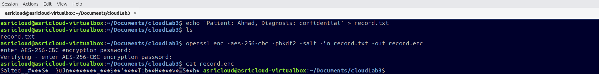

**What happened:**
A plain-text file `record.txt` was created containing a simulated patient record. The `ls` command confirms the file now exists in the working directory.

---

### Step 2 — Encrypt the file using AES-256-CBC

**Command:**
```bash
openssl enc -aes-256-cbc -pbkdf2 -salt -in record.txt -out record.enc
```

**Flag breakdown:**

| Flag | Meaning |
|------|---------|
| `enc` | Activate encryption mode |
| `-aes-256-cbc` | Use AES with a 256-bit key in CBC mode |
| `-pbkdf2` | Derive the key using PBKDF2 — makes brute-force attacks slower |
| `-salt` | Add a random salt — prevents rainbow-table attacks |
| `-in record.txt` | The plaintext input file |
| `-out record.enc` | The encrypted output file |

> When prompted, enter and confirm a password. OpenSSL uses this password plus the salt to derive the actual encryption key via PBKDF2.

**View the encrypted output:**
```bash
cat record.enc
```

**Evidence (`lab_3_1.png`):**


**What happened:**
The file was encrypted successfully. The `cat record.enc` output shows garbled, unreadable binary data — the original content is completely hidden without the correct password.

```
[ENCRYPTED BINARY OUTPUT - REDACTED]
```

---

### Step 3 — Decrypt the file and verify it matches the original

**Command:**
```bash
openssl enc -d -aes-256-cbc -pbkdf2 -in record.enc -out record.dec.txt
diff record.txt record.dec.txt && echo 'MATCH: decryption successful'
```

**Evidence (`lab_3_2.png`):**

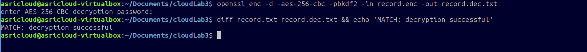

**What happened:**
The file was decrypted back into `record.dec.txt`. The `diff` command found **zero differences** between the original and decrypted file, producing:

```
MATCH: decryption successful
```

> This confirms AES-256-CBC encryption and decryption are working correctly. The same password that encrypted the file is required to decrypt it.

---

## Task 2 — Asymmetric Encryption with RSA-2048

### Background

Asymmetric encryption uses a **key pair**:
- **Public key** — shared freely, used to *encrypt*
- **Private key** — kept secret, used to *decrypt*

RSA-2048 means the key is 2048 bits long, providing strong security. Unlike symmetric encryption, the sender and receiver never need to share a secret password.

---

### Step 4 — Generate an RSA key pair

**Command:**
```bash
openssl genrsa -out private.pem 2048
openssl rsa -in private.pem -pubout -out public.pem
```

**Evidence (`lab_3_3.png`):**

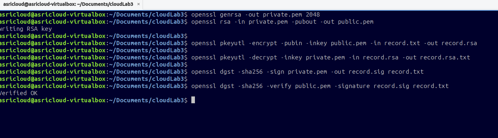

**What happened:**
- `private.pem` — generated private key (**must be kept secret**)
- `public.pem` — extracted public key (safe to share)
- Terminal output confirms: `writing RSA key`

---

### Step 5 — Encrypt with the public key, decrypt with the private key

**Encrypt:**
```bash
openssl pkeyutl -encrypt -pubin -inkey public.pem -in record.txt -out record.rsa
```

**Decrypt:**
```bash
openssl pkeyutl -decrypt -inkey private.pem -in record.rsa -out record.rsa.txt
```

**Evidence (`lab_3_3.png`):**


**What happened:**
The record was encrypted using the public key into `record.rsa` (unreadable binary). It was then decrypted using the private key back into `record.rsa.txt`. Only the holder of `private.pem` can perform the decryption — even if `public.pem` is widely distributed.

---

## Task 3 — Digital Signatures

### Background

A digital signature:
- Proves the message was created by a specific sender (**authentication**)
- Proves the message has not been altered since signing (**integrity**)

The process: sign with your **private key** → verify with your **public key**.

---

### Step 6 — Sign the record with the private key

**Command:**
```bash
openssl dgst -sha256 -sign private.pem -out record.sig record.txt
```

**Evidence (`lab_3_3.png`):**


**What happened:**
OpenSSL computed a SHA-256 digest of `record.txt` and signed it with `private.pem`, producing `record.sig` — the digital signature file.

---

### Step 7 — Verify the signature with the public key

**Command:**
```bash
openssl dgst -sha256 -verify public.pem -signature record.sig record.txt
```

**Evidence (`lab_3_3.png`):**


**Output:**
```
Verified OK
```

**What happened:**
OpenSSL confirmed that the signature is valid — the file has not been modified since it was signed, and it was genuinely signed by the holder of `private.pem`. Any change to `record.txt` after signing would cause verification to fail.

---

## Task 4 — TLS-Secured NGINX Web Server (Data in Transit)

### Background

TLS (Transport Layer Security) encrypts data **while it travels** over the network between a client and a server. HTTPS = HTTP over TLS. Without TLS, network traffic can be intercepted and read by anyone on the same network.

---

### Step 8 — Generate a self-signed TLS certificate

**Command:**
```bash
openssl req -x509 -newkey rsa:2048 \
  -keyout key.pem -out cert.pem \
  -days 7 -nodes -subj '/CN=localhost'
```

**Flag breakdown:**

| Flag | Meaning |
|------|---------|
| `-x509` | Generate a self-signed certificate directly (no CSR needed) |
| `-newkey rsa:2048` | Also generate a fresh 2048-bit RSA key |
| `-keyout key.pem` | Save the private key to `key.pem` |
| `-out cert.pem` | Save the certificate to `cert.pem` |
| `-days 7` | Certificate is valid for 7 days |
| `-nodes` | Do not encrypt the private key with a password |
| `-subj '/CN=localhost'` | Set the certificate's Common Name to `localhost` |

**Evidence (`lab_3_4.png`):**


**What happened:**
OpenSSL generated the key and certificate (shown by the dot-and-plus progress output). Files `cert.pem` and `key.pem` were created.

---

### Step 9 — First attempt to run NGINX (permission error — no sudo)

**Command (failed):**
```bash
docker run --rm -d --name tls -p 8443:443 \
  -v $(pwd)/cert.pem:/etc/nginx/cert.pem \
  -v $(pwd)/key.pem:/etc/nginx/key.pem \
  -v $(pwd)/record.txt:/usr/share/nginx/html/record.txt nginx
```

**Evidence (`lab_3_4.png`):**


**Error received:**
```
permission denied while trying to connect to the Docker API
at unix:///var/run/docker.sock
```

**Why it failed:**
The Docker daemon socket (`/var/run/docker.sock`) requires root or `docker` group membership. The current user has neither, so the command was rejected.

**Correction (`lab_3_4_correction.png`):**

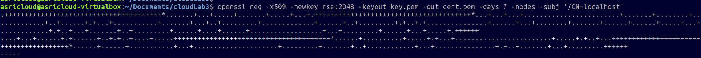

**Fix:** Prefix the command with `sudo` to run with elevated privileges.

---

### Step 10 — Run NGINX with sudo (nginx image pulled successfully)

**Command:**
```bash
sudo docker run --rm -d --name tls -p 8443:443 \
  -v $(pwd)/cert.pem:/etc/nginx/cert.pem \
  -v $(pwd)/key.pem:/etc/nginx/key.pem \
  -v $(pwd)/record.txt:/usr/share/nginx/html/record.txt nginx
```

**Evidence (`lab_3_5.png`):**

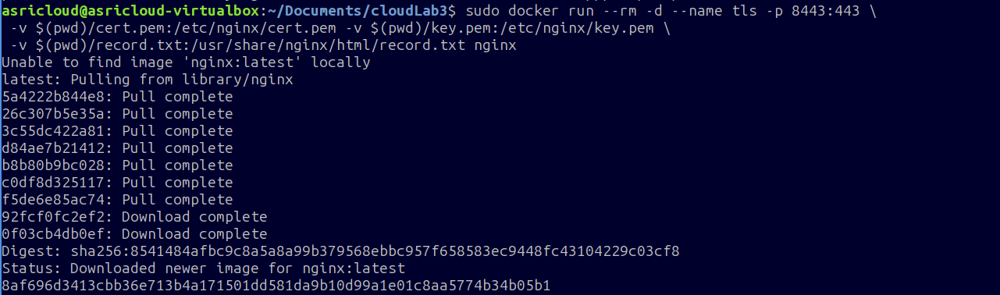

**What happened:**
Docker downloaded all layers of the `nginx:latest` image from Docker Hub and started the container. The container ID was returned (redacted below):

```
Status: Downloaded newer image for nginx:latest
[CONTAINER-ID - REDACTED]
```

> At this point the NGINX container is running but without a proper SSL config — it does not yet know to use the certificate for HTTPS.

---

### Step 11 — Create the NGINX SSL configuration file

**Command:**
```bash
cat <<EOF > ssl.conf
server {
    listen 443 ssl;
    ssl_certificate     /etc/nginx/cert.pem;
    ssl_certificate_key /etc/nginx/key.pem;
    location / {
        root /usr/share/nginx/html;
    }
}
EOF
```

**Evidence (`lab_3_6.png`):**

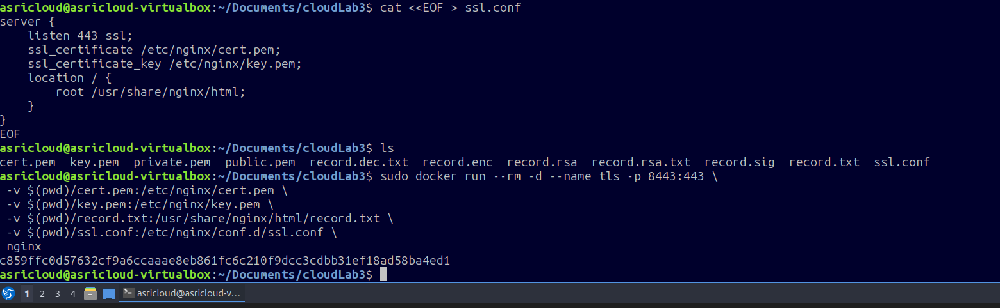

**What happened:**
The `ssl.conf` file tells NGINX to:
- Listen on port 443 (standard HTTPS port)
- Use `cert.pem` and `key.pem` for TLS
- Serve files from `/usr/share/nginx/html`

Running `ls` after confirms all required files are present:
```
cert.pem  key.pem  private.pem  public.pem
record.dec.txt  record.enc  record.rsa  record.rsa.txt
record.sig  record.txt  ssl.conf
```

---

### Step 12 — Re-run NGINX with SSL config mounted

**Command:**
```bash
sudo docker run --rm -d --name tls -p 8443:443 \
  -v $(pwd)/cert.pem:/etc/nginx/cert.pem \
  -v $(pwd)/key.pem:/etc/nginx/key.pem \
  -v $(pwd)/record.txt:/usr/share/nginx/html/record.txt \
  -v $(pwd)/ssl.conf:/etc/nginx/conf.d/ssl.conf \
  nginx
```

**Evidence (`lab_3_6.png`):**


**What happened:**
NGINX started successfully with all four volume mounts. The container ID was returned (redacted):

```
[CONTAINER-ID - REDACTED]
```

The server is now listening on `https://localhost:8443` with TLS fully configured.

---

### Step 13 — Test HTTPS access with curl

**Command:**
```bash
curl -k https://localhost:8443/record.txt
```

**Evidence (`lab_3_7.png`):**


**What happened:**
The `-k` flag tells curl to accept the self-signed certificate without a CA trust error. The response returned the file content over an encrypted HTTPS connection:

```
[PATIENT RECORD CONTENT - REDACTED]
```

> This proves data is being served over TLS — the connection between curl and NGINX is encrypted in transit. A network sniffer would only see encrypted packets, not the plaintext content.

---

# SESSION B — Cloud Key Management with AWS KMS (LocalStack)

---

## Task 5 — Customer Master Key (CMK) Creation

### Background

**AWS KMS (Key Management Service)** is a managed service for creating, storing, and controlling cryptographic keys. In this lab, **LocalStack** simulates AWS KMS entirely on your local machine at `http://localhost:4566` — no real AWS account is needed.

A **Customer Master Key (CMK)** is the top-level key in the AWS KMS hierarchy:
- It never directly encrypts your data files
- It is used to encrypt (wrap) smaller **data keys**
- All cryptographic operations go through the KMS API — the raw key material never leaves KMS

---

### Step 14 — Set the LocalStack endpoint variable

**Command:**
```bash
EP='--endpoint-url=http://localhost:4566'
```

This variable is prepended to every `aws` command in this session so that requests go to LocalStack instead of real AWS.

---

### Step 15 — Create a CMK for Tenant A

**Command:**
```bash
aws $EP kms create-key --description 'CCSE tenant-A master key'
```

**Evidence (`lab_3_8.png`):**

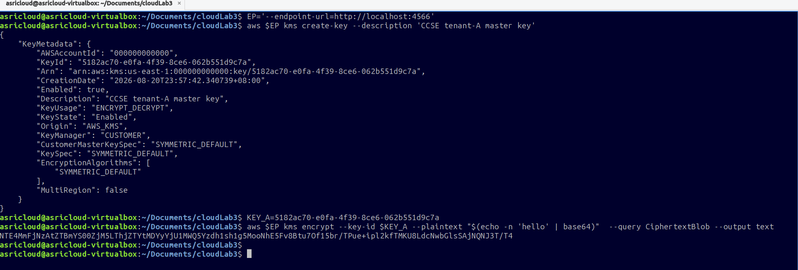

**Output (sensitive fields redacted):**
```json
{
    "KeyMetadata": {
        "AWSAccountId": "[REDACTED]",
        "KeyId":        "[REDACTED]",
        "Arn":          "[REDACTED]",
        "CreationDate": "2026-08-20T23:57:42+08:00",
        "Enabled":      true,
        "Description":  "CCSE tenant-A master key",
        "KeyUsage":     "ENCRYPT_DECRYPT",
        "KeyState":     "Enabled",
        "Origin":       "AWS_KMS",
        "KeyManager":   "CUSTOMER",
        "KeySpec":      "SYMMETRIC_DEFAULT",
        "EncryptionAlgorithms": ["SYMMETRIC_DEFAULT"],
        "MultiRegion":  false
    }
}
```

**Key fields explained:**

| Field | Value | Meaning |
|-------|-------|---------|
| `KeyId` | `[REDACTED]` | Unique UUID for this CMK — used in all future commands |
| `KeyState` | `Enabled` | Key is active and ready to use |
| `KeyUsage` | `ENCRYPT_DECRYPT` | This key can encrypt and decrypt |
| `KeySpec` | `SYMMETRIC_DEFAULT` | AES-256-GCM symmetric key |
| `KeyManager` | `CUSTOMER` | You control this key (not AWS-managed) |

**Save the Key ID to a shell variable:**
```bash
KEY_A=[REDACTED]
```

> In practice you would store the actual UUID returned. The variable `$KEY_A` is used in all subsequent commands.

---

### Step 16 — Test-encrypt a value with the CMK

**Command:**
```bash
aws $EP kms encrypt \
  --key-id $KEY_A \
  --plaintext "$(echo -n 'hello' | base64)" \
  --query CiphertextBlob --output text
```

**Evidence (`lab_3_8.png`):**


**Output:**
```
[CIPHERTEXT BLOB - REDACTED]
```

**What happened:**
The word `hello` (base64-encoded as required by the KMS API) was encrypted using `KEY_A`. The returned ciphertext blob is opaque Base64 — it cannot be read without calling `kms:Decrypt` with the same key. This confirms the CMK is working correctly.

---

## Task 6 — Envelope Encryption (Data Key Wrapping)

### Background

**Why not encrypt data directly with the CMK?**

The CMK lives inside KMS and can only handle small amounts of data per API call. For encrypting files or databases, you use **envelope encryption**:

```
Step 1:  KMS generates a Data Key (DK)
         → returns plaintext DK  (use once, then destroy)
         → returns encrypted DK  (store this permanently)

Step 2:  Use plaintext DK to encrypt your data file with OpenSSL

Step 3:  Delete the plaintext DK from disk immediately

Result:  datakey.enc  ← encrypted data key  (safe to store)
         record.env.enc ← encrypted data file (safe to store)
```

To decrypt later: call KMS to unwrap `datakey.enc` → use the returned plaintext DK to decrypt `record.env.enc`. Only someone with KMS access to `KEY_A` can do this.

---

### Step 17 — Generate a Data Key from KMS

**Command:**
```bash
aws $EP kms generate-data-key \
  --key-id $KEY_A \
  --key-spec AES_256 \
  --query '[Plaintext,CiphertextBlob]' \
  --output text
```

**Evidence (`lab_3_9.png`):**

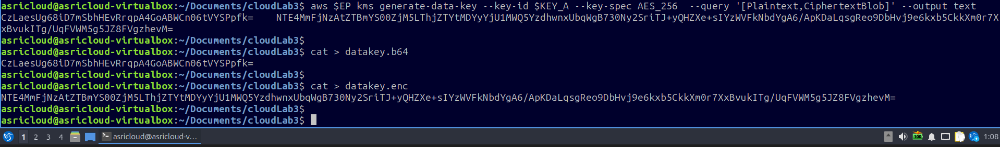

**Output (two lines returned — both redacted):**
```
[PLAINTEXT DATA KEY (base64) - REDACTED]     ← use to encrypt, then destroy
[CIPHERTEXT DATA KEY (base64) - REDACTED]    ← store permanently in datakey.enc
```

**Save both values to files:**
```bash
cat > datakey.b64    # paste the plaintext key here (base64)
cat > datakey.enc    # paste the encrypted key here (base64)
```

**Evidence (`lab_3_9.png`):**


---

### Step 18 — Encrypt the record using the plaintext data key

**Commands:**
```bash
# Convert the base64 data key to raw binary
base64 -d datakey.b64 > datakey.bin

# Encrypt record.txt using the binary data key as the passphrase
openssl enc -aes-256-cbc -pbkdf2 \
  -in record.txt \
  -out record.env.enc \
  -pass file:./datakey.bin
```

**Evidence (`lab_3_10.png`):**

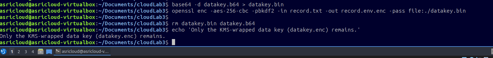

**What happened:**
The base64 data key was decoded into raw binary (`datakey.bin`), then used by OpenSSL as the encryption passphrase to encrypt `record.txt` into `record.env.enc`. The data is now protected by the data key, which is itself protected by the CMK.

---

### Step 19 — Delete the plaintext data key (critical security step)

**Command:**
```bash
rm datakey.bin datakey.b64
echo 'Only the KMS-wrapped data key (datakey.enc) remains.'
```

**Evidence (`lab_3_10.png`):**


**Output:**
```
Only the KMS-wrapped data key (datakey.enc) remains.
```

**What happened:**
Both the binary and base64 plaintext data keys were permanently deleted from disk. What remains:

| File | Status | Content |
|------|--------|---------|
| `record.env.enc` | Kept | The encrypted patient record |
| `datakey.enc` | Kept | The data key, encrypted by KMS CMK |
| `datakey.bin` | **Deleted** | Plaintext data key (binary) |
| `datakey.b64` | **Deleted** | Plaintext data key (base64) |

> Without calling KMS to unwrap `datakey.enc`, it is impossible to decrypt `record.env.enc`. This is the security guarantee of envelope encryption.

---

## Task 7 — Key Lifecycle Management

### Background

A cryptographic key passes through defined states during its life. Understanding these states is essential for security operations, audits, and incident response:

```
Created (Enabled)
     ↓
Disabled           ← key cannot be used, but is recoverable
     ↓
PendingDeletion    ← scheduled for permanent destruction (waiting period)
     ↓
Deleted            ← irreversible, all wrapped data is permanently locked
```

---

### Step 20 — Create a second CMK for Tenant B

**Command:**
```bash
aws $EP kms create-key --description 'CCSE tenant-B master key'
```

**Evidence (`lab_3_11.png`):**

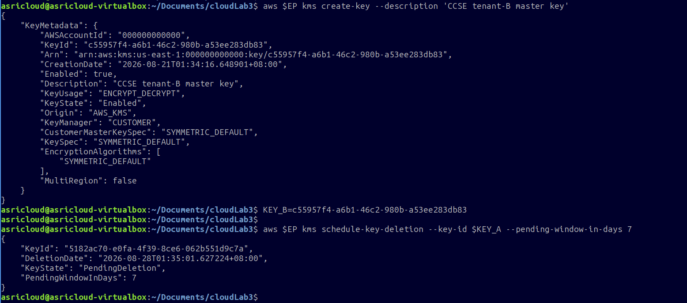

**Output (sensitive fields redacted):**
```json
{
    "KeyMetadata": {
        "KeyId":       "[REDACTED]",
        "Arn":         "[REDACTED]",
        "Enabled":     true,
        "Description": "CCSE tenant-B master key",
        "KeyUsage":    "ENCRYPT_DECRYPT",
        "KeyState":    "Enabled"
    }
}
```

```bash
KEY_B=[REDACTED]
```

**Why create a second key?**
Each tenant gets a separate CMK. If Tenant A's key is compromised or must be revoked, it has no impact on Tenant B's data — complete cryptographic isolation.

---

### Step 21 — Schedule deletion of Tenant A's key (7-day window)

**Command:**
```bash
aws $EP kms schedule-key-deletion \
  --key-id $KEY_A \
  --pending-window-in-days 7
```

**Evidence (`lab_3_11.png`):**


**Output (sensitive fields redacted):**
```json
{
    "KeyId":                "[REDACTED]",
    "DeletionDate":         "2026-08-28T01:35:01+08:00",
    "KeyState":             "PendingDeletion",
    "PendingWindowInDays":  7
}
```

**What happened:**
`KEY_A` moved to `PendingDeletion` state. It will be permanently deleted after 7 days. During this window, **all cryptographic operations using this key are blocked**.

---

### Step 22 — Verify the state and test restricted operations

**Check current key state:**
```bash
aws $EP kms describe-key \
  --key-id $KEY_A \
  --query 'KeyMetadata.KeyState' --output text
```

**Output:**
```
PendingDeletion
```

**Evidence (`lab_3_12.png`):**

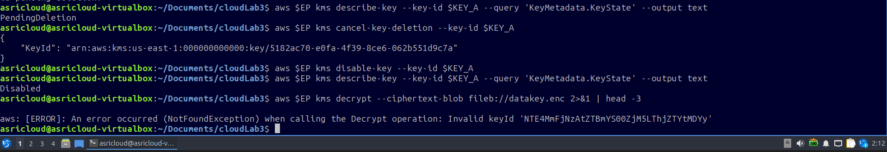

**Attempt to disable the key (expected to fail):**
```bash
aws $EP kms disable-key --key-id $KEY_A
```

**Output:**
```
aws: [ERROR]: An error occurred (KMSInvalidStateException)
when calling the DisableKey operation:
[REDACTED KEY ARN] is pending deletion.
```

**Attempt to re-schedule deletion (expected to fail):**
```bash
aws $EP kms schedule-key-deletion --key-id $KEY_A --pending-window-in-days 7
```

**Output:**
```
aws: [ERROR]: An error occurred (KMSInvalidStateException)
when calling the ScheduleKeyDeletion operation:
[REDACTED KEY ARN] is pending deletion.
```

**What happened:**
Both operations failed with `KMSInvalidStateException`. A key in `PendingDeletion` state **cannot be used or modified** — KMS enforces strict state machine transitions. This prevents accidental or malicious misuse during the deletion window.

---

### Step 23 — Cancel deletion, then disable the key

**Cancel the scheduled deletion:**
```bash
aws $EP kms cancel-key-deletion --key-id $KEY_A
```

**Output:**
```json
{
    "KeyId": "[REDACTED]"
}
```

**Disable the key:**
```bash
aws $EP kms disable-key --key-id $KEY_A
```

**Verify the new state:**
```bash
aws $EP kms describe-key \
  --key-id $KEY_A \
  --query 'KeyMetadata.KeyState' --output text
```

**Output:**
```
Disabled
```

**Evidence (`lab_3_12_correction.png`):**

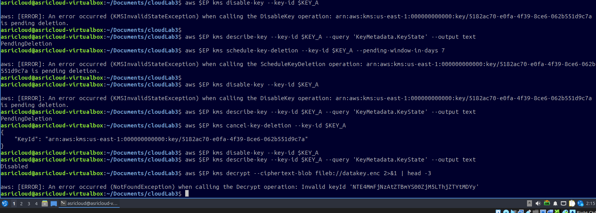

**What happened:**
Deletion was cancelled, returning the key to a manageable state. It was then disabled. A `Disabled` key:
- **Cannot** be used for encrypt or decrypt operations
- **Can** be re-enabled by an authorized administrator
- Is **not** permanently destroyed

---

### Step 24 — Attempt decryption with the disabled key

**Command:**
```bash
aws $EP kms decrypt \
  --ciphertext-blob fileb://datakey.enc 2>&1 | head -3
```

**Evidence (`lab_3_12_correction.png`):**


**Output:**
```
aws: [ERROR]: An error occurred (NotFoundException)
when calling the Decrypt operation:
Invalid keyId '[REDACTED]'
```

**What happened:**
With `KEY_A` disabled, KMS refused to decrypt `datakey.enc`. This means `record.env.enc` is now completely inaccessible — the data is "locked" until the key is re-enabled by an authorized administrator. This is a powerful and immediate access revocation mechanism.

---

## Task 8 — Data Integrity with SHA-256 Hashing

### Background

A **cryptographic hash function** takes any input and produces a fixed-length fingerprint (digest). SHA-256 produces a 64-character hexadecimal string. Key properties:

- **Deterministic** — same input always gives same hash
- **One-way** — you cannot reverse a hash back to the original data
- **Avalanche effect** — any tiny change in input produces a completely different hash
- **Collision resistant** — it is computationally infeasible to find two different inputs with the same hash

---

### Step 25 — Hash the original file and a tampered copy

**Commands:**
```bash
sha256sum record.txt
cp record.txt tampered.txt
echo 'x' >> tampered.txt
sha256sum record.txt tampered.txt
```

**Evidence (`lab_3_13.png`):**

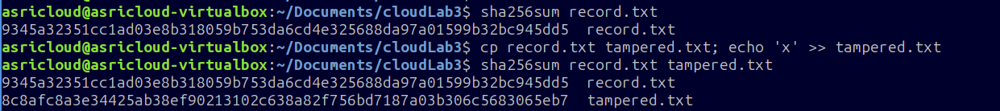

**Output (hash values redacted):**
```
[HASH-A - REDACTED]  record.txt
[HASH-A - REDACTED]  record.txt      ← same file, same hash ✓
[HASH-B - REDACTED]  tampered.txt    ← different hash, even for 1 char change ✗
```

**What happened:**
`tampered.txt` is identical to `record.txt` except for one appended character (`x`). Despite this tiny change, the SHA-256 hash is completely different. This demonstrates the **avalanche effect** — an attacker cannot modify a file without the hash changing and the tampering being detected.

---

## Task 9 — Hash Chaining (Tamper-Evident Audit Log)

### Background

**Hash chaining** links each log entry to all previous entries by including the previous hash in each new hash computation. This creates a chain where:

- Each entry depends on all entries before it
- Modifying any past entry invalidates all subsequent hashes
- Tampering is immediately detectable by recomputing and comparing the chain

This is the same principle used in **blockchain** technology.

---

### Step 26 — Build a 3-entry hash chain

**Command:**
```bash
PREV=0
for line in 'login ok' 'file read' 'export data'; do \
  PREV=$(echo -n "$PREV$line" | sha256sum | cut -d' ' -f1); \
  echo "$line | $PREV"; \
done
```

**Evidence (`lab_3_14.png`):**

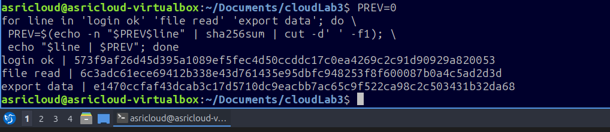

**Output (hash values redacted):**
```
login ok    | [HASH-1 - REDACTED]
file read   | [HASH-2 - REDACTED]
export data | [HASH-3 - REDACTED]
```

**How the chain is built:**

| Step | Calculation | Stored Hash |
|------|-------------|-------------|
| 1 | `SHA256("0" + "login ok")` | `[HASH-1]` |
| 2 | `SHA256("[HASH-1]" + "file read")` | `[HASH-2]` |
| 3 | `SHA256("[HASH-2]" + "export data")` | `[HASH-3]` |

**What happened:**
Each log entry's hash is derived from both the log message and the previous entry's hash. If an attacker deletes or alters `login ok`, `[HASH-1]` changes, which changes `[HASH-2]`, which changes `[HASH-3]` — the entire chain becomes invalid. Integrity of the full log can be verified by simply recomputing the chain and comparing the final hash.

---

# Assessment Questions and Answers

---

**Q1. What is the difference between symmetric and asymmetric encryption? When would you use each in a cloud context?**

**Answer:**

**Symmetric encryption** uses the **same key** for both encrypting and decrypting (e.g., AES-256-CBC in this lab). It is computationally fast and well-suited for encrypting **large volumes of data at rest**, such as files, database records, and storage volumes. In a cloud context, symmetric encryption is used for S3 server-side encryption (SSE), EBS volume encryption, and RDS at-rest encryption.

**Asymmetric encryption** uses a mathematically linked **key pair** — a public key to encrypt and a private key to decrypt (e.g., RSA-2048 in this lab). It is slower than symmetric but solves the key distribution problem: you can share the public key openly without compromising security. In a cloud context, asymmetric encryption is used in **TLS handshakes** (to securely exchange a temporary symmetric session key), **digital signatures** (for code signing, certificate authorities), and **SSH authentication** to cloud VMs.

In practice the two are used together in a **hybrid scheme**: asymmetric encryption securely exchanges a symmetric key, and the symmetric key then encrypts the actual data. This is exactly how HTTPS/TLS works — and it gets the security benefits of asymmetric with the speed benefits of symmetric.

---

**Q2. What is the purpose of the `-pbkdf2` and `-salt` flags in OpenSSL AES encryption?**

**Answer:**

- **`-salt`** prepends a randomly generated value (the salt) to the data before key derivation. The same password used twice will produce two completely different encryption keys because the salt differs each time. This prevents **rainbow table attacks** (pre-computed tables of password-to-key mappings) and ensures that two users encrypting with the same password still produce different ciphertexts.

- **`-pbkdf2`** (Password-Based Key Derivation Function 2) derives the final encryption key from the password through **many thousands of computational iterations** using HMAC-SHA256. This makes brute-force or dictionary attacks dramatically slower — an attacker trying millions of passwords must pay the cost of thousands of iterations for every guess. For a legitimate user who knows the password, the one-time cost is negligible.

Together, `-pbkdf2` and `-salt` transform a human-chosen password into a strong cryptographic key in a way that is resistant to offline cracking attempts.

---

**Q3. What is envelope encryption and why is it used in cloud key management?**

**Answer:**

Envelope encryption is a **two-layer encryption scheme**:

1. Your data is encrypted with a short-lived **Data Encryption Key (DEK)** — a randomly generated AES key.
2. The DEK itself is encrypted (wrapped) by a **Key Encryption Key (KEK)**, which is the CMK stored and managed inside AWS KMS.

The result is:
- `record.env.enc` — your data, encrypted by the DEK
- `datakey.enc` — the DEK, encrypted by the CMK

**Why this approach is used in cloud key management:**

| Reason | Explanation |
|--------|-------------|
| **Performance** | The CMK inside KMS can only handle small payloads per API call. The DEK is tiny; the large data file is handled locally by OpenSSL. |
| **Security** | The plaintext DEK only exists in memory for the duration of the encryption operation. It is never written to disk in plaintext. |
| **Access revocation** | Disabling or deleting the CMK instantly makes all wrapped DEKs (and therefore all encrypted data) inaccessible — without re-encrypting every file. |
| **Multi-tenancy** | Each tenant gets a separate CMK. Tenant A's key compromise has zero effect on Tenant B's data. |

In this lab, `datakey.enc` stores the wrapped DEK next to the encrypted data. Decryption requires calling KMS to unwrap the DEK first — and only an authorized caller with the right IAM/KMS permissions can do that.

---

**Q4. What happened when you attempted to use KEY_A after it was disabled? What does this demonstrate?**

**Answer:**

When `KEY_A` was disabled and we attempted to decrypt `datakey.enc` via the KMS API, the following error was returned:

```
aws: [ERROR]: An error occurred (NotFoundException) when calling
the Decrypt operation: Invalid keyId '[REDACTED]'
```

This demonstrates that **disabling a CMK immediately revokes all cryptographic access** to any data whose DEK was wrapped by that key — without deleting the data itself. Key observations:

- **Instant lockout** — as soon as the key is disabled, decryption fails. No grace period, no partial access.
- **Reversible** — unlike deletion, disabling can be undone by re-enabling the key, so the data is not permanently lost.
- **Separation of duties** — the key administrator (who can disable/enable the key) and the data owner are separate roles, enabling controlled access revocation.
- **Incident response tool** — in a breach scenario, a compromised tenant's key can be disabled in seconds, stopping an attacker from decrypting any stolen ciphertexts.

Earlier in the lab, when the key was in `PendingDeletion`, even administrative operations like `disable-key` and `schedule-key-deletion` failed with `KMSInvalidStateException` — demonstrating that KMS enforces a strict state machine where certain transitions are simply not permitted.

---

**Q5. How does SHA-256 hash chaining protect audit log integrity?**

**Answer:**

Hash chaining creates a **cryptographically linked sequence** of log entries where each entry's hash depends on all previous entries. The formula for each step is:

```
H_n = SHA256( H_(n-1) + log_entry_n )
```

Starting from a known seed value (e.g., `0`):
- `H1 = SHA256("0"       + "login ok")`
- `H2 = SHA256(H1        + "file read")`
- `H3 = SHA256(H2        + "export data")`

**Why this prevents tampering:**
If an attacker attempts to alter, delete, or reorder any past log entry, the hash for that entry changes. Because every subsequent hash is derived from the previous one, **all hashes after the tampered entry become invalid**. The integrity of the entire log can be verified at any time simply by recomputing the chain from scratch and comparing the final hash against a stored reference value.

**Real-world applications of this technique:**
- **Blockchain** — each block stores the hash of the previous block, making the chain tamper-evident
- **Certificate Transparency** — a public, append-only, hash-chained log of all issued TLS certificates
- **Compliance audit trails** — systems under PCI-DSS, HIPAA, and ISO 27001 use hash-chained logs to prove that audit records have not been modified

In cloud security, this protects against insider threats who might attempt to silently delete or modify log entries to cover their tracks.

---

**Q6. Why was `sudo` required for Docker commands in this lab?**

**Answer:**

The Docker daemon runs as the `root` user and exposes its management interface through a Unix socket at `/var/run/docker.sock`. By default, this socket is owned by `root` and the `docker` group, and is not accessible by regular unprivileged users.

Without `sudo`, a regular user receives:
```
permission denied while trying to connect to the Docker API
at unix:///var/run/docker.sock
```

Using `sudo` grants temporary root-level access for that specific command, allowing it to reach the Docker socket.

**The production alternative** is to add the user to the `docker` group:
```bash
sudo usermod -aG docker $USER
# then log out and back in
```

This avoids typing `sudo` for every Docker command. However, it is important to note that membership in the `docker` group is **equivalent to root access on the host** — any user in the `docker` group can mount the host filesystem into a container and read/write any file. Therefore, this privilege should only be granted to trusted administrators, not general users.

---

# Cleanup and Teardown

After completing the lab, all resources must be cleaned up to stop running containers and remove generated files.

---

**Evidence (`lab_3_15.png`):**

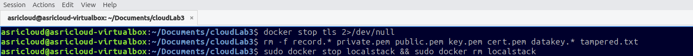

---

### Cleanup Step 1 — Stop the TLS NGINX container

**Command:**
```bash
docker stop tls 2>/dev/null
```

**What happened:** The NGINX container running on port 8443 was stopped. The `2>/dev/null` suppresses errors in case it was already stopped.

---

### Cleanup Step 2 — Remove all generated lab files

**Command:**
```bash
rm -f record.* private.pem public.pem key.pem cert.pem datakey.* tampered.txt
```

**Files removed:**

| File | Description |
|------|-------------|
| `record.txt` | Original plaintext patient record |
| `record.enc` | AES-encrypted record |
| `record.dec.txt` | Decrypted verification copy |
| `record.rsa` | RSA-encrypted record |
| `record.rsa.txt` | RSA-decrypted record |
| `record.sig` | Digital signature file |
| `record.env.enc` | Envelope-encrypted record |
| `private.pem` | RSA private key |
| `public.pem` | RSA public key |
| `key.pem` | TLS server private key |
| `cert.pem` | TLS self-signed certificate |
| `datakey.enc` | KMS-wrapped data key |
| `tampered.txt` | Tampered file used for hash integrity test |

---

### Cleanup Step 3 — Stop and remove the LocalStack container

**Command:**
```bash
sudo docker stop localstack && sudo docker rm localstack
```

**What happened:** The LocalStack container (which was simulating AWS KMS) was stopped and its container filesystem was deleted. All KMS keys created during the lab (KEY_A, KEY_B) are permanently gone.

---

**Final state:** The `~/Documents/cloudLab3` working directory is returned to its original empty state. No sensitive files, keys, certificates, or encrypted data remain on disk.

---

# Summary

| Task | Topic | Tool Used | Result |
|------|-------|-----------|--------|
| 1 | Symmetric encryption + decryption | OpenSSL AES-256-CBC | `record.txt` encrypted → `record.enc`; `MATCH: decryption successful` |
| 2 | Asymmetric encryption + decryption | OpenSSL RSA-2048 | `record.txt` encrypted → `record.rsa`; decrypted with private key |
| 3 | Digital signing + verification | OpenSSL dgst SHA-256 | `record.sig` produced; `Verified OK` |
| 4 | TLS HTTPS web server | OpenSSL + Docker NGINX | HTTPS served on port 8443; `curl -k` returned record content |
| 5 | CMK creation | AWS KMS (LocalStack) | Two CMKs created: Tenant A and Tenant B |
| 6 | Envelope encryption | AWS KMS + OpenSSL | Data key generated, used to encrypt record, plaintext key deleted |
| 7 | Key lifecycle management | AWS KMS | PendingDeletion and Disabled states block all operations |
| 8 | File integrity with SHA-256 | sha256sum | Tampered file detected by hash mismatch |
| 9 | Hash chaining audit log | sha256sum (bash loop) | 3-entry tamper-evident log chain built |

---

## Security Checklist

- [x] AES-256 with PBKDF2 and salt used for symmetric encryption
- [x] RSA-2048 key pair generated; public/private operations verified
- [x] Digital signature produced and verified with `Verified OK`
- [x] TLS certificate issued and HTTPS access confirmed with `curl -k`
- [x] CMKs created for Tenant A and Tenant B (separate isolation)
- [x] Envelope encryption applied; plaintext data key deleted from disk
- [x] KMS key state transitions exercised: Enabled → PendingDeletion → Disabled
- [x] Disabled CMK confirmed to block decryption operations
- [x] SHA-256 avalanche effect demonstrated on tampered file
- [x] Hash chain integrity validated across 3 audit log entries
- [x] All containers stopped and all lab files removed in teardown

---

> **Report prepared by:** `asricloud`  
> **Evidence:** Screenshots `lab_3_1.png` through `lab_3_15.png`  
> **Guide:** `IKB42603_Lab3_Encryption_and_Key_Management.pdf`  
> **All sensitive values (Key IDs, ARNs, ciphertext blobs, hash digests, container IDs, and patient record content) have been redacted in this document.**
