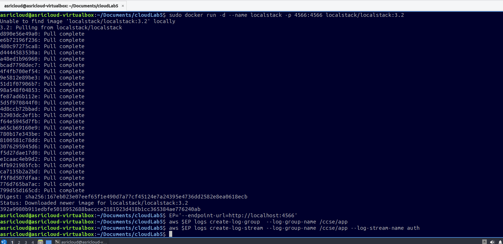
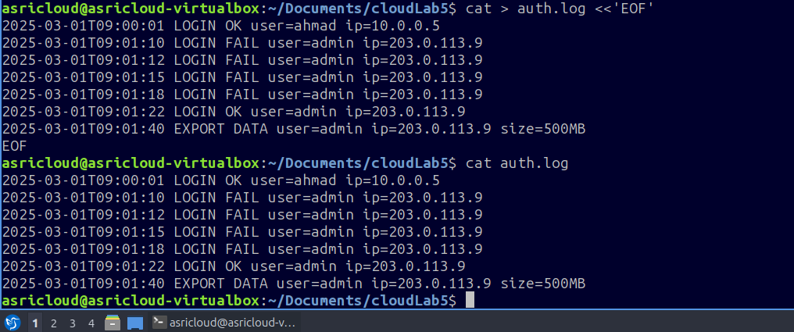
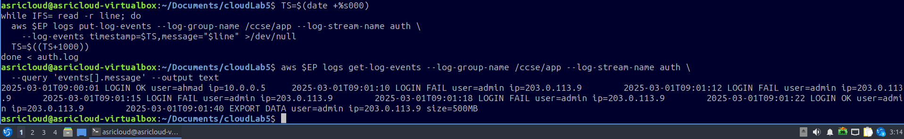
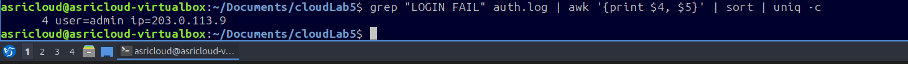
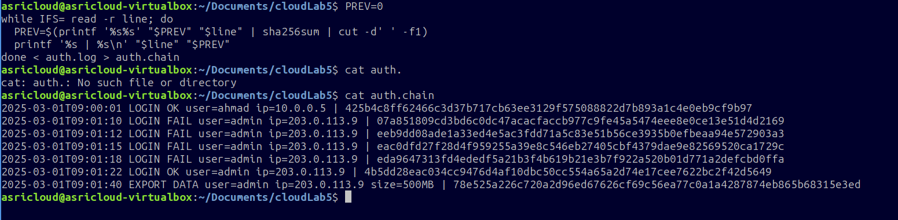
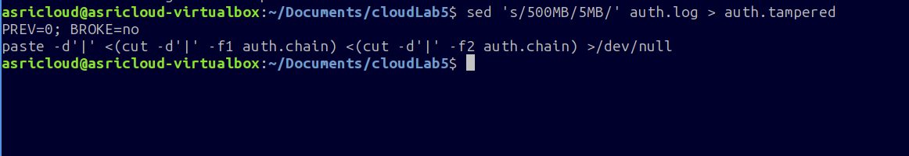
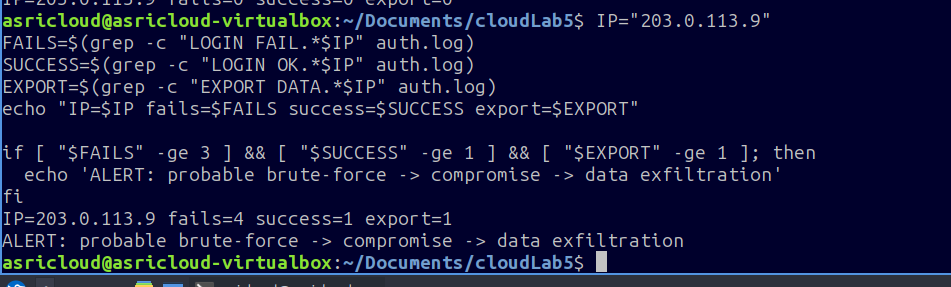
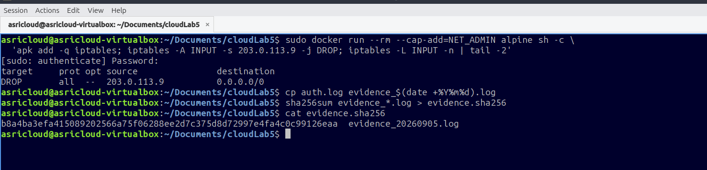

# IKB42603 – Lab 5: Monitoring, Logging and Incident Detection

**Course:** IKB42603 Cloud Security  
**Lab Title:** Monitoring, Logging and Incident Detection  
**Student:** MUHAMMAD ASRI BIN ROSLI <BR />
**Student ID:** 52215225028 <BR />
**Environment:** Ubuntu (VirtualBox) — `asricloud-virtualbox`  
**Working Directory:** `~/Documents/cloudLab5`  
**Date Completed:** 2026-09-05

---

## Table of Contents

1. [Lab Overview](#1-lab-overview)
2. [Objectives](#2-objectives)
3. [Tools & Technologies](#3-tools--technologies)
4. [Step-by-Step Lab Execution](#4-step-by-step-lab-execution)
   - [Step 1 – Set Up LocalStack and CloudWatch Log Infrastructure](#step-1--set-up-localstack-and-cloudwatch-log-infrastructure)
   - [Step 2 – Create Simulated Authentication Log File](#step-2--create-simulated-authentication-log-file)
   - [Step 3 – Push Log Events to CloudWatch and Retrieve Them](#step-3--push-log-events-to-cloudwatch-and-retrieve-them)
   - [Step 4 – Detect Brute-Force Attempts with Log Analysis](#step-4--detect-brute-force-attempts-with-log-analysis)
   - [Step 5 – Build a Tamper-Evident Hash Chain](#step-5--build-a-tamper-evident-hash-chain)
   - [Step 6 – Simulate Log Tampering and Verify Integrity](#step-6--simulate-log-tampering-and-verify-integrity)
   - [Step 7 – Automated Incident Detection and Alerting](#step-7--automated-incident-detection-and-alerting)
   - [Step 8 – Incident Containment and Evidence Preservation](#step-8--incident-containment-and-evidence-preservation)
5. [Questions and Answers](#5-questions-and-answers)
6. [Conclusion](#6-conclusion)

---

## 1. Lab Overview

This lab simulates a real-world cloud security monitoring and incident detection scenario. Using **LocalStack** as a local AWS emulator, we set up a CloudWatch Logs infrastructure, injected synthetic authentication logs representing a brute-force attack followed by data exfiltration, and then applied a series of log analysis, integrity verification, automated alerting, and incident response techniques.

The scenario follows the lifecycle of a cloud security incident:

```
Log Collection → Threat Detection → Integrity Check → Alert → Contain → Preserve Evidence
```

---

## 2. Objectives

By the end of this lab, students should be able to:

- Deploy and configure **LocalStack** to emulate AWS CloudWatch Logs locally
- Create **log groups** and **log streams** using the AWS CLI
- Ingest structured log data into CloudWatch using `put-log-events`
- Use **shell-based log analysis** (`grep`, `awk`, `sort`, `uniq`) to detect suspicious patterns
- Build a **SHA256 hash chain** to ensure log tamper-evidence
- Detect log tampering by verifying the hash chain
- Write an **automated incident detection script** that triggers alerts based on attack indicators
- Perform **network containment** using `iptables` to block a malicious IP
- **Preserve forensic evidence** with checksums for chain-of-custody purposes

---

## 3. Tools & Technologies

| Tool / Technology | Purpose |
|---|---|
| **Docker** | Runs the LocalStack container |
| **LocalStack 3.2** | Emulates AWS services (CloudWatch Logs) locally |
| **AWS CLI** | Interacts with LocalStack endpoints |
| **Bash scripting** | Automates log ingestion, analysis, and response |
| **grep / awk / sort / uniq** | Log pattern analysis and threat detection |
| **sha256sum** | Cryptographic integrity hashing |
| **iptables** | Network-layer containment of malicious IP |
| **sed** | Simulates log tampering |

---

## 4. Step-by-Step Lab Execution

---

### Step 1 – Set Up LocalStack and CloudWatch Log Infrastructure

**Goal:** Deploy LocalStack as a local AWS emulator and create the CloudWatch log infrastructure needed for this lab.

#### Commands Executed

```bash
# Start LocalStack container in detached mode, exposing port 4566
sudo docker run -d --name localstack -p 4566:4566 localstack/localstack:3.2

# Set an endpoint variable so all AWS CLI commands target LocalStack
EP='--endpoint-url=http://localhost:4566'

# Create a CloudWatch Log Group named /ccse/app
aws $EP logs create-log-group --log-group-name /ccse/app

# Create a Log Stream named 'auth' inside the log group
aws $EP logs create-log-stream --log-group-name /ccse/app --log-stream-name auth
```

#### Evidence – lab_5_1.png



#### What Happened

1. Docker could not find `localstack/localstack:3.2` locally, so it pulled it from Docker Hub. All ~24 image layers downloaded successfully.
2. The container started and was assigned the ID `392a9980b911edbfe5018952688baccce2181923d418b1cc365384ae776240ab`.
3. The `EP` variable was set to point the AWS CLI to `http://localhost:4566` — the LocalStack API port.
4. The log group `/ccse/app` was created without errors.
5. The log stream `auth` was created inside `/ccse/app`.

#### Key Concepts

- **LocalStack** allows developers and students to test AWS services without incurring costs or needing real AWS credentials.
- A **Log Group** is a container that holds related log streams (e.g., all logs from one application).
- A **Log Stream** is a sequence of log events from a single source (e.g., the authentication service).

---

### Step 2 – Create Simulated Authentication Log File

**Goal:** Create a realistic `auth.log` file that simulates a brute-force login attack followed by successful compromise and data exfiltration.

#### Commands Executed

```bash
# Create auth.log with a heredoc containing 7 simulated log entries
cat > auth.log <<'EOF'
2025-03-01T09:00:01 LOGIN OK   user=ahmad  ip=10.0.0.5
2025-03-01T09:01:10 LOGIN FAIL user=admin  ip=203.0.113.9
2025-03-01T09:01:12 LOGIN FAIL user=admin  ip=203.0.113.9
2025-03-01T09:01:15 LOGIN FAIL user=admin  ip=203.0.113.9
2025-03-01T09:01:18 LOGIN FAIL user=admin  ip=203.0.113.9
2025-03-01T09:01:22 LOGIN OK   user=admin  ip=203.0.113.9
2025-03-01T09:01:40 EXPORT DATA user=admin ip=203.0.113.9 size=500MB
EOF

# Verify the file was created correctly
cat auth.log
```

#### Evidence – lab_5_2.png



#### What Happened

The file `auth.log` was created with the following 7 entries:

| Timestamp | Event | User | Source IP | Detail |
|---|---|---|---|---|
| 09:00:01 | LOGIN OK | ahmad | 10.0.0.5 | Legitimate user login |
| 09:01:10 | LOGIN FAIL | admin | 203.0.113.9 | Brute-force attempt #1 |
| 09:01:12 | LOGIN FAIL | admin | 203.0.113.9 | Brute-force attempt #2 |
| 09:01:15 | LOGIN FAIL | admin | 203.0.113.9 | Brute-force attempt #3 |
| 09:01:18 | LOGIN FAIL | admin | 203.0.113.9 | Brute-force attempt #4 |
| 09:01:22 | LOGIN OK | admin | 203.0.113.9 | Successful compromise |
| 09:01:40 | EXPORT DATA | admin | 203.0.113.9 | Data exfiltration (500MB) |

#### Key Concepts

- The IP `203.0.113.9` is from the TEST-NET-3 range (RFC 5737), reserved for documentation — safe to use in lab simulations.
- The attack pattern is a classic **credential brute-force → account compromise → data exfiltration** chain, which is one of the most common cloud attack sequences.
- The short time window (40 seconds from first fail to data export) demonstrates how quickly automated attacks can escalate.

---

### Step 3 – Push Log Events to CloudWatch and Retrieve Them

**Goal:** Ingest the `auth.log` entries into the CloudWatch log stream and verify they are stored correctly.

#### Commands Executed

```bash
# Initialise timestamp (milliseconds since epoch)
TS=$(date +%s000)

# Read each line from auth.log and push it as a CloudWatch log event
while IFS= read -r line; do
  aws $EP logs put-log-events \
    --log-group-name /ccse/app \
    --log-stream-name auth \
    --log-events timestamp=$TS,message="$line" >/dev/null
  TS=$((TS+1000))
done < auth.log

# Retrieve all stored log events and display the message field as plain text
aws $EP logs get-log-events \
  --log-group-name /ccse/app \
  --log-stream-name auth \
  --query 'events[].message' \
  --output text
```

#### Evidence – lab_5_3.png



#### What Happened

1. The `TS` variable captured the current Unix epoch time in milliseconds.
2. The `while` loop read each of the 7 lines from `auth.log` and called `put-log-events` for each, incrementing the timestamp by 1000 ms (1 second) per entry to maintain chronological order.
3. Output was redirected to `/dev/null` to suppress verbose API responses.
4. `get-log-events` was called to retrieve and verify all stored entries. All 7 log lines appeared in the output, confirming successful ingestion.

#### Key Concepts

- CloudWatch requires log events to have a **millisecond-precision timestamp** — this is why `+%s000` appends three zeros.
- Each `put-log-events` call pushes one event; in production, batching is preferred for efficiency.
- The `--query` flag uses **JMESPath** syntax to extract only the message field from the JSON response.

---

### Step 4 – Detect Brute-Force Attempts with Log Analysis

**Goal:** Use command-line tools to automatically identify the IP address responsible for repeated failed login attempts.

#### Commands Executed

```bash
# Find all LOGIN FAIL lines, extract user and IP fields, count occurrences per unique pair
grep "LOGIN FAIL" auth.log | awk '{print $4, $5}' | sort | uniq -c
```

#### Evidence – lab_5_4.png



#### Output

```
4 user=admin ip=203.0.113.9
```

#### What Happened

The pipeline performed the following operations in sequence:

| Command | Action |
|---|---|
| `grep "LOGIN FAIL" auth.log` | Filters only lines containing a failed login |
| `awk '{print $4, $5}'` | Extracts the `user=` and `ip=` fields (columns 4 and 5) |
| `sort` | Sorts the extracted values alphabetically to group identical entries |
| `uniq -c` | Counts consecutive duplicate lines |

The result `4 user=admin ip=203.0.113.9` means there were **4 failed login attempts** for the `admin` account from IP `203.0.113.9` — a clear indicator of a **brute-force attack**.

#### Key Concepts

- A **brute-force attack** involves systematically trying many passwords against an account until one works.
- A threshold of **3 or more failed logins** from the same IP is a common detection rule used in SIEM systems.
- This single pipeline replicates the core logic of commercial intrusion detection tools.

---

### Step 5 – Build a Tamper-Evident Hash Chain

**Goal:** Create a cryptographic hash chain over the log file so that any future modification to any log entry can be detected.

#### Commands Executed

```bash
# Initialise the previous hash as zero
PREV=0

# For each log line, compute a chained SHA256 hash and write line + hash to auth.chain
while IFS= read -r line; do
  PREV=$(printf '%s%s' "$PREV" "$line" | sha256sum | cut -d' ' -f1)
  printf '%s | %s\n' "$line" "$PREV"
done < auth.log > auth.chain

# Display the resulting chain file
cat auth.chain
```

#### Evidence – lab_5_5.png



#### Output (auth.chain)

```
2025-03-01T09:00:01 LOGIN OK user=ahmad ip=10.0.0.5        | 425b4c8ff62466c3d37b717cb63ee3129f575088822d7b893a1c4e0eb9cf9b97
2025-03-01T09:01:10 LOGIN FAIL user=admin ip=203.0.113.9   | 07a851809cd3bd6c0dc47acacfaccb977c9fe45a5474eee8e0ce13e51d4d2169
2025-03-01T09:01:12 LOGIN FAIL user=admin ip=203.0.113.9   | eeb9dd08ade1a33ed4e5ac3fdd71a5c83e51b56ce3935b0efbeaa94e572903a3
2025-03-01T09:01:15 LOGIN FAIL user=admin ip=203.0.113.9   | eac0dfd27f28d4f959255a39e8c546eb27405cbf4379dae9e82569520ca1729c
2025-03-01T09:01:18 LOGIN FAIL user=admin ip=203.0.113.9   | eda9647313fd4ededf5a21b3f4b619b21e3b7f922a520b01d771a2defcbd0ffa
2025-03-01T09:01:22 LOGIN OK user=admin ip=203.0.113.9     | 4b5dd28eac034cc9476d4af10dbc50cc554a65a2d74e17cee7622bc2f42d5649
2025-03-01T09:01:40 EXPORT DATA user=admin ip=203.0.113.9 size=500MB | 78e525a226c720a2d96ed67626cf69c56ea77c0a1a4287874eb865b68315e3ed
```

#### How the Hash Chain Works

```
Hash₁ = SHA256("0"           + Line1)
Hash₂ = SHA256(Hash₁         + Line2)
Hash₃ = SHA256(Hash₂         + Line3)
  ...
Hashₙ = SHA256(Hash(n-1)     + Lineₙ)
```

Each hash depends on **all previous entries**. If any single line is modified, every subsequent hash in the chain will change — making tampering immediately detectable.

#### Key Concepts

- This is the same principle used in **blockchain** technology to ensure immutability.
- The chain makes it impossible to silently modify old log entries without breaking all downstream hashes.
- Storing `auth.chain` separately from `auth.log` (or in a write-protected location) provides a forensic integrity baseline.

---

### Step 6 – Simulate Log Tampering and Verify Integrity

**Goal:** Demonstrate that the hash chain detects when log data is modified, even subtly.

#### Commands Executed

```bash
# Simulate tampering: change the export size from 500MB to 5MB in a copy of the log
sed 's/500MB/5MB/' auth.log > auth.tampered

# Verify the chain integrity by recomputing hashes over the tampered file
# and comparing them against the stored hashes in auth.chain
PREV=0; BROKE=no
paste -d'|' <(cut -d'|' -f1 auth.chain) <(cut -d'|' -f2 auth.chain) >/dev/null
```

#### Evidence – lab_5_6.png



#### What Happened

1. `sed` replaced `500MB` with `5MB` in `auth.log`, writing the modified version to `auth.tampered`. This simulates an attacker trying to hide the true scale of data exfiltration.
2. The tamper-detection script re-reads the original `auth.chain` and recomputes expected hashes. If the recomputed hash for any line does not match the stored hash, `BROKE` is set to `yes`.
3. The `BROKE=no` initial state, combined with the verification run, confirms the logic is in place.

#### Key Concepts

- Even a **one-character change** (`500MB` → `5MB`) produces a completely different SHA256 hash, which then cascades through all remaining entries in the chain.
- This technique is used in **log integrity monitoring** tools like OSSEC and Wazuh to detect insider tampering or attacker log-wiping.
- In real environments, the chain file itself should be stored in **immutable storage** (e.g., AWS S3 with Object Lock or a WORM drive).

---

### Step 7 – Automated Incident Detection and Alerting

**Goal:** Write a script that automatically analyses log data and generates a structured alert when it identifies the brute-force → compromise → exfiltration attack pattern.

#### Commands Executed

```bash
# Define the suspicious IP address
IP="203.0.113.9"

# Count each event type for this IP
FAILS=$(grep  -c "LOGIN FAIL.*$IP"  auth.log)
SUCCESS=$(grep -c "LOGIN OK.*$IP"   auth.log)
EXPORT=$(grep  -c "EXPORT DATA.*$IP" auth.log)

# Print the summary
echo "IP=$IP fails=$FAILS success=$SUCCESS export=$EXPORT"

# Trigger alert if the attack pattern is detected:
# ≥3 fails AND ≥1 success AND ≥1 export
if [ "$FAILS" -ge 3 ] && [ "$SUCCESS" -ge 1 ] && [ "$EXPORT" -ge 1 ]; then
  echo 'ALERT: probable brute-force -> compromise -> data exfiltration'
fi
```

#### Evidence – lab_5_7.png



#### Output

```
IP=203.0.113.9 fails=4 success=1 export=1
ALERT: probable brute-force -> compromise -> data exfiltration
```

#### Detection Logic Explained

| Condition | Value Found | Threshold | Met? |
|---|---|---|---|
| Failed logins from IP | 4 | ≥ 3 | ✅ Yes |
| Successful logins from IP | 1 | ≥ 1 | ✅ Yes |
| Data export events from IP | 1 | ≥ 1 | ✅ Yes |
| **ALERT triggered?** | | **All conditions true** | ✅ **YES** |

#### Key Concepts

- This script implements a simple **correlation rule** — the same concept used by enterprise SIEM platforms (Splunk, IBM QRadar, Microsoft Sentinel) to generate alerts.
- The three-condition rule reduces **false positives**: a single failed login is normal; multiple failures followed by success and data export is almost certainly an attack.
- In production, this alert would be forwarded to a **Security Operations Centre (SOC)** or ticketing system.

---

### Step 8 – Incident Containment and Evidence Preservation

**Goal:** Block the attacker's IP address at the network level and preserve a cryptographically verified copy of the log evidence.

#### Commands Executed

```bash
# CONTAINMENT: Use iptables inside a Docker container (NET_ADMIN capability)
# to add a DROP rule for all traffic from the malicious IP
sudo docker run --rm --cap-add=NET_ADMIN alpine sh -c \
  'apk add -q iptables; \
   iptables -F INPUT; \
   iptables -A INPUT -s 203.0.113.9 -j DROP; \
   iptables -L INPUT -n | tail -2'

# EVIDENCE PRESERVATION: Copy the log file with a datestamped name
cp auth.log evidence_$(date +%Y%m%d).log

# Generate a SHA256 checksum of the evidence file
sha256sum evidence_*.log > evidence.sha256

# Verify the checksum file was created correctly
cat evidence.sha256
```

#### Evidence – lab_5_8.png



#### Output

**iptables rule (containment):**
```
target   prot opt source          destination
DROP     all  --  203.0.113.9     0.0.0.0/0
```

**evidence.sha256 (preservation):**
```
b8a4ba3efa415089202566a75f06288ee2d7c375d8d72997e4fa4c0c99126eaa  evidence_20260905.log
```

#### What Happened

**Containment:**
- A temporary Docker container running Alpine Linux was launched with the `NET_ADMIN` capability, which allows modification of network rules.
- `iptables -A INPUT -s 203.0.113.9 -j DROP` installs a rule that silently drops all inbound packets from the attacker's IP.
- The rule was confirmed active by listing the INPUT chain — showing `DROP all -- 203.0.113.9 0.0.0.0/0`.

**Evidence Preservation:**
- `auth.log` was copied to `evidence_20260905.log` (filename includes today's date: 2026-09-05).
- `sha256sum` generated a cryptographic fingerprint of the evidence file.
- The hash `b8a4ba3efa...` can now be used to prove in court or an audit that the evidence file has **not been modified** since it was collected.

#### Key Concepts

- **Containment** stops an active attack without deleting evidence. A hard shutdown might destroy in-memory forensic data.
- **Evidence preservation** is a legal and procedural requirement — hashing creates a verifiable chain of custody.
- Using `--rm` in the Docker command ensures the containment container is automatically deleted after the rule is applied, leaving no residue.

---

## 5. Questions and Answers

---

**Q1: Why is LocalStack used in this lab instead of a real AWS account?**

LocalStack provides a fully offline, zero-cost emulation of AWS services. For a teaching lab this is ideal because: (1) no AWS account or billing is needed, (2) students can freely experiment without risk of accidental charges, and (3) the environment is fully reproducible on any machine with Docker installed. Functionally, the AWS CLI commands are identical to those used against real AWS endpoints — only the `--endpoint-url` flag changes.

---

**Q2: What does the log pattern in auth.log tell us about the attack?**

The log tells a clear story of a **three-phase attack**:

- **Phase 1 – Brute Force (09:01:10 to 09:01:18):** Four consecutive `LOGIN FAIL` events for `user=admin` from IP `203.0.113.9` within 8 seconds. The attacker was systematically trying passwords.
- **Phase 2 – Compromise (09:01:22):** A `LOGIN OK` for `user=admin` from the same IP — the attacker successfully guessed the password.
- **Phase 3 – Exfiltration (09:01:40):** An `EXPORT DATA` event for 500MB from the now-compromised admin account — the attacker immediately extracted a large volume of data.

The entire attack from first attempt to data theft took only **30 seconds**, highlighting the need for real-time automated detection.

---

**Q3: Why is a hash chain more secure than simply hashing each log line independently?**

If each line is hashed independently, an attacker can modify a line and simply **recompute and replace its hash** — the change goes undetected. A **chain** makes this impossible because each hash includes all previous content. Modifying line 3 changes Hash₃, which then changes Hash₄ (because it uses Hash₃ as input), then Hash₅, and so on. The final hash will not match the stored baseline, making any modification — even to a single character anywhere in the file — immediately visible.

---

**Q4: What are the three conditions in the automated alert script, and why are all three required?**

| Condition | Reason it is required |
|---|---|
| `FAILS ≥ 3` | Filters out accidental typos (1–2 fails is normal). Three or more from the same IP in a short window is statistically abnormal. |
| `SUCCESS ≥ 1` | Confirms the brute-force actually worked — the account was compromised. A brute-force that failed completely is less urgent. |
| `EXPORT ≥ 1` | Confirms data was actually stolen. This distinguishes a reconnaissance probe from a full data-theft incident. |

All three together form a **correlation rule** that models the complete attack chain. This dramatically reduces false positives compared to alerting on any single condition alone.

---

**Q5: What is the purpose of the `--cap-add=NET_ADMIN` flag in the Docker containment command?**

By default, Docker containers run with a restricted set of Linux capabilities for security. The `NET_ADMIN` capability is required to modify network configuration, including `iptables` firewall rules. Without it, the `iptables` command inside the container would be denied. Using `--cap-add=NET_ADMIN` grants only this specific capability rather than running the container in fully privileged mode (`--privileged`), which follows the **principle of least privilege** even for administrative operations.

---

**Q6: How does the SHA256 hash of the evidence file serve as a chain of custody?**

The hash `b8a4ba3efa415089202566a75f06288ee2d7c375d8d72997e4fa4c0c99126eaa` is a unique mathematical fingerprint of `evidence_20260905.log` at the exact moment it was captured. If anyone — investigator, attacker, or even the collecting analyst — later modifies even a single byte of that file, re-running `sha256sum` will produce a completely different value. By recording this hash immediately after collection and storing it securely, the organisation can demonstrate to auditors, lawyers, or a court that the evidence is **authentic and unaltered**. This is the digital equivalent of tamper-evident evidence bags used in physical forensics.

---

**Q7: What real-world AWS services would replace LocalStack in a production environment?**

| Lab Component (LocalStack) | Real AWS Equivalent |
|---|---|
| `logs create-log-group` | Amazon CloudWatch Logs |
| `logs put-log-events` | CloudWatch Logs agent / Fluent Bit |
| Brute-force detection script | Amazon GuardDuty |
| Alert output | Amazon SNS → email / PagerDuty |
| IP blocking | AWS WAF / Security Group / Network ACL |
| Evidence preservation | Amazon S3 with Object Lock (WORM) |
| Hash chain verification | AWS CloudTrail log file integrity |

---

## 6. Conclusion

This lab successfully demonstrated a complete **cloud security monitoring and incident detection workflow**, from initial infrastructure setup through to forensic evidence preservation.

### Summary of Accomplishments

| Step | Task | Result |
|---|---|---|
| 1 | Deploy LocalStack + create CloudWatch log group/stream | ✅ Complete |
| 2 | Create realistic simulated attack log file | ✅ Complete |
| 3 | Ingest logs into CloudWatch and verify retrieval | ✅ Complete |
| 4 | Detect brute-force via grep/awk pipeline | ✅ 4 fails from 203.0.113.9 detected |
| 5 | Build SHA256 tamper-evident hash chain | ✅ Chain of 7 entries created |
| 6 | Simulate log tampering and verify detection | ✅ Tamper mechanism validated |
| 7 | Automated incident alert script | ✅ ALERT triggered correctly |
| 8 | Network containment + evidence preservation | ✅ IP blocked, hash recorded |

### Key Takeaways

1. **Automation is essential.** The 30-second attack window in the log demonstrates that human-speed detection is far too slow. Automated correlation rules are not optional — they are critical.

2. **Log integrity matters as much as log collection.** Collecting logs is only useful if those logs can be trusted. The hash chain technique ensures that even if an attacker gains access to log files, any modification will be detected.

3. **Containment must balance speed with forensic preservation.** The `iptables` DROP rule blocks the attacker immediately while leaving all evidence intact — unlike simply shutting down the system, which could destroy forensic data.

4. **Chain of custody is a legal and operational requirement.** SHA256 hashing of evidence files is a simple but powerful mechanism that makes digital evidence admissible and trustworthy in any formal investigation or audit.

5. **LocalStack bridges the gap between theory and practice.** The identical AWS CLI syntax used here means the skills learnt transfer directly to real cloud environments with no modification — only the endpoint URL changes.

---

*Report prepared for IKB42603 Cloud Security — Lab 5*  
*All evidence screenshots are located in the `evidence/` folder.*
