# IKB42603 Cloud Computing Security Essentials
<br /> NAME: MUHAMMAD ASRI BIN ROSLI <BR/>
STUDENT ID: 52215225028 <BR />
## Lab 4 — Access Control & Network Security
### AuthN vs AuthZ, Network Segmentation and Host Hardening — Docker & Kubernetes

| Field | Details |
|---|---|
| **Course** | IKB42603 Cloud Computing Security Essentials |
| **Lab** | Lab 4 (Weeks 7–8) |
| **Institution** | UniKL MIIT |
| **Lecturer** | Prof. Dr. Shahrulniza Musa |
| **CLO** | CLO2 — Construct secure cloud operations that safeguard data integrity |

---

## Table of Contents

1. [Lab Overview](#1-lab-overview)
2. [Learning Outcomes](#2-learning-outcomes)
3. [Session A — Authentication & Authorization (Week 7)](#3-session-a--authentication--authorization-week-7)
   - [Task 1 — HTTP Basic Authentication](#task-1--http-basic-authentication)
   - [Task 2 — Multi-Factor Authentication (TOTP/MFA)](#task-2--multi-factor-authentication-totpmfa)
   - [Task 3 — Authorization with Kubernetes RBAC](#task-3--authorization-with-kubernetes-rbac)
4. [Session B — Network Security & Hardening (Week 8)](#4-session-b--network-security--hardening-week-8)
   - [Task 4 — Network Segmentation (Three-Tier)](#task-4--network-segmentation-three-tier)
   - [Task 5 — Firewall Rules (Default-Deny)](#task-5--firewall-rules-default-deny)
   - [Task 6 — Container Hardening & Vulnerability Scanning](#task-6--container-hardening--vulnerability-scanning)
5. [Short-Answer Questions](#5-short-answer-questions)
6. [Security Best-Practices Checklist](#6-security-best-practices-checklist)

---

## 1. Lab Overview

This lab is split into two sessions across two weeks. The focus is on two fundamental pillars of cloud security:

- **Session A (Week 7):** Controls **WHO gets in** — Authentication, MFA, and RBAC Authorization.
- **Session B (Week 8):** Controls **WHAT they can reach** — Network Segmentation, Firewall Rules, and Container Hardening.

> **Key Concept:** Identity is the perimeter. Every control in this lab asks the same two questions: *Are you who you claim to be?* (AuthN) and *Are you allowed to do this?* (AuthZ).

| Term | Meaning |
|---|---|
| **AuthN** | Authentication — proving *who you are* |
| **AuthZ** | Authorization — deciding *what you may do* |
| **TOTP** | Time-based One-Time Password (used in MFA) |
| **RBAC** | Role-Based Access Control |
| **Segmentation** | Dividing a network so services only reach what they must |

---

## 2. Learning Outcomes

By the end of this lab, the student is able to:

1. Distinguish and implement **authentication** (who you are) vs **authorization** (what you may do).
2. Add a second factor with a **TOTP (MFA)** code and verify it.
3. Configure **network access control and segmentation** so services only reach what they require.
4. Harden a container image: non-root user, minimal image, dropped capabilities, read-only filesystem.
5. Scan an image for vulnerabilities and apply the **principle of least privilege** across compute, network, and storage.

---

## 3. Session A — Authentication & Authorization (Week 7)

---

### Task 1 — HTTP Basic Authentication

#### Objective
Run a web service behind HTTP Basic authentication so that only requests with valid credentials are accepted. This demonstrates the core of **AuthN** — proving who you are before gaining access.

#### What We Did

**Step 1 — Create the password file**

Using the `httpd:alpine` Docker image and the `htpasswd` utility, a Bcrypt-hashed password file was generated for the user `student`.

```bash
sudo docker run --rm httpd:alpine htpasswd -nbB student 'P@ssword!' > htpasswd.txt
```

> 🔒 **Confidential:** The contents of `htpasswd.txt` (the hashed password) are not shown in this report as they are sensitive credentials.

**Step 2 — Create the Nginx configuration**

An Nginx config file was written to enable HTTP Basic Auth, pointing to the password file.

```bash
echo 'Authenticated OK' > index.html

cat > default.conf <<'EOF'
server {
    listen 80;
    location / {
        auth_basic "Restricted";
        auth_basic_user_file /etc/nginx/.htpasswd;
        root /usr/share/nginx/html;
        index index.html;
    }
}
EOF
```

**Step 3 — Launch the authenticated Nginx container**

The container named `authsvc` was started on port 8080, mounting the config and password file.

```bash
sudo docker run --rm -d --name authsvc -p 8080:80 \
  -v $(pwd)/default.conf:/etc/nginx/conf.d/default.conf \
  -v $(pwd)/htpasswd.txt:/etc/nginx/.htpasswd \
  -v $(pwd)/index.html:/usr/share/nginx/html/index.html nginx
```

**Step 4 — Test the authentication**

Two `curl` requests were made to verify the authentication gate is working:

```bash
# Test without credentials → should be rejected
curl -s -o /dev/null -w 'no-creds: %{http_code}\n' http://localhost:8080

# Test with valid credentials → should succeed
curl -s -u student:'P@ssword!' http://localhost:8080
```

#### Evidence — `lab_4_1.png` & `lab_4_2.png`

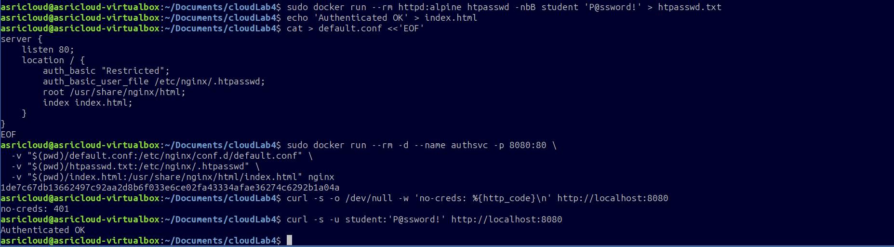
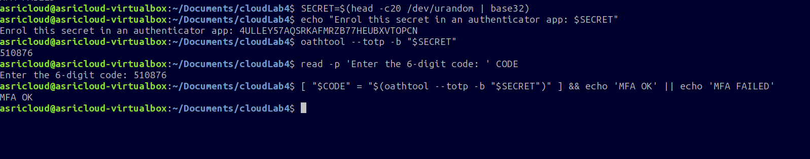

#### Result

| Test | HTTP Response | Meaning |
|---|---|---|
| No credentials | `401 Unauthorized` | Access correctly denied — unauthenticated |
| Valid credentials (`student`) | `200 OK` — `Authenticated OK` | Access correctly granted — authenticated |

> **Why this matters:** The server enforces authentication at the entry point. Any request without valid credentials is rejected before it can touch any resource. This is the first line of defence.

---

### Task 2 — Multi-Factor Authentication (TOTP/MFA)

#### Objective
Passwords alone can be stolen, phished, or leaked. A **Time-based One-Time Password (TOTP)** adds a second factor — something the user *has* (an authenticator app or device) — making credential attacks far harder to succeed.

#### What We Did

**Step 1 — Generate a shared secret**

A random 20-byte value was encoded in Base32 to create a TOTP shared secret. In a real application, the user would scan this as a QR code into their authenticator app (Google Authenticator, Microsoft Authenticator, etc.).

```bash
SECRET=$(head -c20 /dev/urandom | base32)
echo "Enrol this secret in an authenticator app: $SECRET"
```

> 🔒 **Confidential:** The actual `$SECRET` value is not shown in this report as it is a sensitive cryptographic key.

**Step 2 — Generate the current 6-digit TOTP code**

`oathtool` was used to generate the current time-based code from the secret.

```bash
oathtool --totp -b "$SECRET"
```

**Step 3 — Simulate user input and validate**

The user entered the 6-digit code. The system compared it against the expected code generated at that moment.

```bash
read -p 'Enter the 6-digit code: ' CODE
[ "$CODE" = "$(oathtool --totp -b "$SECRET")" ] && echo 'MFA OK' || echo 'MFA FAILED'
```

#### Evidence — `lab_4_3.png`

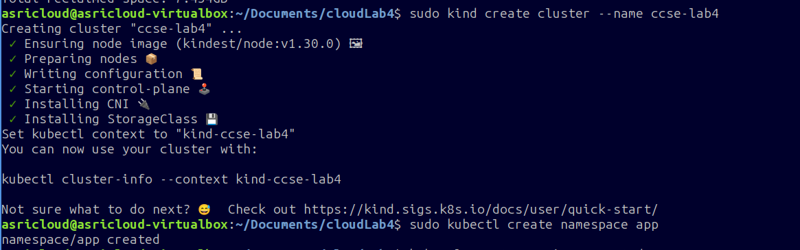

#### Result

| Step | Output | Meaning |
|---|---|---|
| Secret generation | `Enrol this secret in an authenticator app: [REDACTED]` | Shared secret created successfully |
| TOTP code generated | A 6-digit code (e.g., `510876`) | Code valid only for ~30 seconds |
| User entered matching code | `MFA OK` | Second factor verified successfully |

> **Why this matters:** Even if an attacker steals a password, they still cannot log in without the current TOTP code. The code changes every 30 seconds and is only valid once, making replay attacks impossible.

---

### Task 3 — Authorization with Kubernetes RBAC

#### Objective
Authentication proves *who you are*. Authorization decides *what you may do*. This task creates a Kubernetes cluster with a **developer service account** whose permissions are tightly scoped — it can only read pods, not create or delete anything.

#### What We Did

**Step 1 — Create the Kubernetes cluster**

A local `kind` cluster named `ccse-lab4` was created.

```bash
sudo kind create cluster --name ccse-lab4
```

**Step 2 — Create the namespace**

A dedicated `app` namespace was created to isolate resources.

```bash
sudo kubectl create namespace app
```

#### Evidence — `lab_4_4.png`

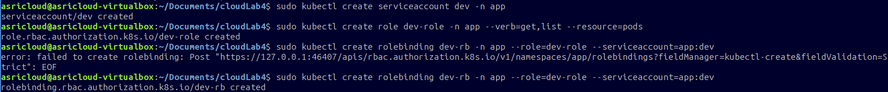

The cluster was successfully created with all components:
- Node image: `kindest/node:v1.30.0`
- Control-plane started
- CNI and StorageClass installed
- `kubectl` context set to `kind-ccse-lab4`

**Step 3 — Create a service account, role, and role binding**

A service account `dev` was created, then a Role allowing only `get` and `list` on pods, and finally a RoleBinding to link them.

```bash
sudo kubectl create serviceaccount dev -n app

sudo kubectl create role dev-role -n app \
  --verb=get,list --resource=pods

sudo kubectl create rolebinding dev-rb -n app \
  --role=dev-role --serviceaccount=app:dev
```

#### Evidence — `lab_4_5.png`

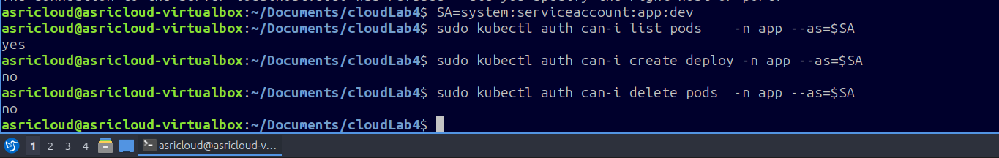

> **Note:** A transient API server connection error occurred on the first `rolebinding` attempt, but the command succeeded on retry. This is normal behaviour when the cluster is freshly initialised.

**Step 4 — Verify the permissions (can-i checks)**

The `kubectl auth can-i` command was used to confirm the `dev` service account has exactly the permissions intended — no more, no less.

```bash
SA=system:serviceaccount:app:dev

sudo kubectl auth can-i list pods    -n app --as=$SA   # Expected: yes
sudo kubectl auth can-i create deploy -n app --as=$SA  # Expected: no
sudo kubectl auth can-i delete pods  -n app --as=$SA   # Expected: no
```

#### Evidence — `lab_4_6.png`

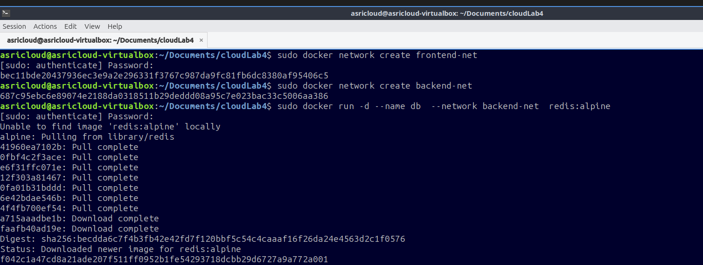

#### Result

| Permission Check | Result | Meaning |
|---|---|---|
| `list pods` | **yes** | Developer can view pod status |
| `create deploy` | **no** | Developer cannot deploy new workloads |
| `delete pods` | **no** | Developer cannot remove running pods |

> **Why this matters:** This is the **principle of least privilege** in action. The developer account has exactly what it needs to do its job and nothing more. Even if this account is compromised, the blast radius is limited — an attacker cannot deploy malicious workloads or destroy running services.

---

## 4. Session B — Network Security & Hardening (Week 8)

---

### Task 4 — Network Segmentation (Three-Tier)

#### Objective
In a real application, the web tier, application tier, and database tier should not all be able to communicate freely. **Network segmentation** places them in separate networks so that even if the web server is compromised, the attacker cannot directly reach the database.

#### Architecture

```
Internet
    │
  [web]  ── frontend-net ──  [app]
                               │
                          backend-net
                               │
                             [db]
```

- `web` is only on `frontend-net` — it cannot see `db`
- `app` is on **both** networks — it bridges the tiers
- `db` is only on `backend-net` — invisible from the front tier

#### What We Did

**Step 1 — Create the two isolated networks**

```bash
sudo docker network create frontend-net
sudo docker network create backend-net
```

**Step 2 — Start the database (db) on the backend network only**

A Redis container was launched exclusively on `backend-net`.

```bash
sudo docker run -d --name db --network backend-net redis:alpine
```

#### Evidence — `lab_4_7.png`

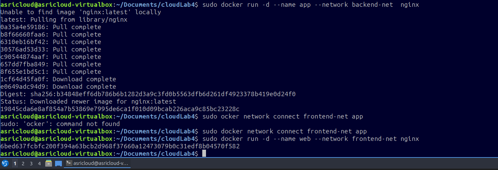

> 🔒 **Confidential:** Container IDs and image digest hashes are redacted from this report.

**Step 3 — Start the app container and connect it to both networks**

```bash
sudo docker run -d --name app --network backend-net nginx
sudo docker network connect frontend-net app
```

#### Evidence — `lab_4_8.png`


**Step 4 — Start the web container on the frontend network only**

```bash
sudo docker run -d --name web --network frontend-net nginx:alpine
```

#### Evidence — `lab_4_9.png`

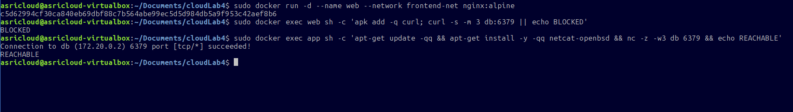

**Step 5 — Test connectivity to verify segmentation**

```bash
# web → db: should FAIL (different networks, no path)
sudo docker exec web sh -c 'apk add -q curl; curl -s -m 3 db:6379 || echo BLOCKED'

# app → db: should SUCCEED (both on backend-net)
sudo docker exec app sh -c \
  'apt-get update -qq && apt-get install -y -qq netcat-openbsd && nc -z -w3 db 6379 && echo REACHABLE'
```

#### Evidence — `lab_4_10.png`

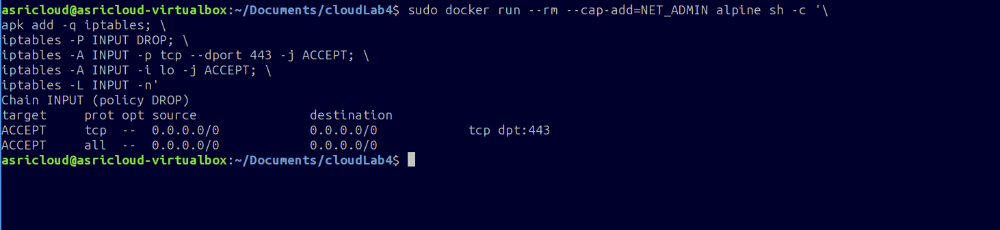

#### Result

| Path | Result | Reason |
|---|---|---|
| `web` → `db` | **BLOCKED** | `web` is only on `frontend-net`; `db` is only on `backend-net` — no route exists |
| `app` → `db` | **REACHABLE** | `app` is connected to both networks — it can reach `db` on port 6379 |

> **Why this matters:** An attacker who fully compromises the `web` container still has no network path to `db`. They would need to also compromise `app` (the next tier) before reaching the database. Segmentation forces the attacker to work harder and creates more opportunities for detection.

---

### Task 5 — Firewall Rules (Default-Deny)

#### Objective
Network segmentation controls which containers can talk to which. **Firewall rules** control which ports and protocols are allowed at the host level. A **default-deny** policy means all traffic is blocked unless explicitly permitted — mirroring how cloud security groups and NACLs work.

#### What We Did

A throwaway container with `NET_ADMIN` capability was used to demonstrate iptables rules in an isolated environment.

```bash
sudo docker run --rm --cap-add=NET_ADMIN alpine sh -c '
  apk add -q iptables;
  iptables -P INPUT DROP;
  iptables -A INPUT -p tcp --dport 443 -j ACCEPT;
  iptables -A INPUT -i lo -j ACCEPT;
  iptables -L INPUT -n'
```

**What each rule does:**

| Rule | Effect |
|---|---|
| `-P INPUT DROP` | **Default policy: DROP.** All incoming traffic is blocked unless a rule explicitly allows it. |
| `-A INPUT -p tcp --dport 443 -j ACCEPT` | Allow HTTPS traffic (TCP port 443) inbound. |
| `-A INPUT -i lo -j ACCEPT` | Allow loopback interface traffic (necessary for local processes to communicate). |

#### Evidence — `lab_4_11.png`

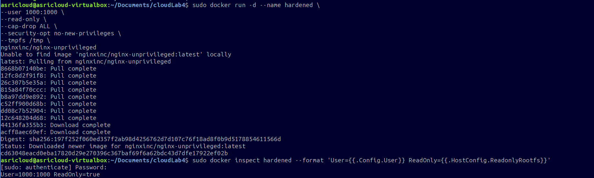

#### Result

The `iptables -L INPUT -n` output confirmed:

```
Chain INPUT (policy DROP)
target   prot opt  source      destination
ACCEPT   tcp  --   0.0.0.0/0   0.0.0.0/0    tcp dpt:443
ACCEPT   all  --   0.0.0.0/0   0.0.0.0/0
```

- **Default policy is DROP** — nothing gets through unless explicitly listed.
- Only **HTTPS (port 443)** and **loopback** traffic are permitted.
- All other ports (HTTP/80, SSH/22, etc.) are silently blocked.

> **Why this matters:** This is the exact model used by AWS Security Groups, Azure NSGs, and GCP firewall rules. "Deny all, permit by exception" is the gold standard — it ensures that newly opened ports or newly deployed services don't accidentally become accessible until someone explicitly allows them.

---

### Task 6 — Container Hardening & Vulnerability Scanning

#### Objective
Even with good authentication and network controls, a container with excessive privileges can be weaponised if compromised. **Container hardening** removes unnecessary capabilities and permissions, shrinking the attack surface. **Vulnerability scanning** identifies known CVEs before deployment.

#### What We Did

**Step 1 — Run a hardened container**

Five hardening measures were applied simultaneously:

```bash
sudo docker run -d --name hardened \
  --user 1000:1000 \
  --read-only \
  --cap-drop ALL \
  --security-opt no-new-privileges \
  --tmpfs /tmp \
  nginxinc/nginx-unprivileged
```

| Flag | Hardening Measure | Attack it Defeats |
|---|---|---|
| `--user 1000:1000` | Run as non-root UID 1000 | Prevents container breakout from giving root on the host |
| `--read-only` | Read-only root filesystem | Stops malware writing persistence files or modifying binaries |
| `--cap-drop ALL` | Drop all Linux capabilities | Removes ability to load kernel modules, change network config, etc. |
| `--security-opt no-new-privileges` | No privilege escalation | Blocks `setuid` binaries from elevating permissions |
| `--tmpfs /tmp` | In-memory writable /tmp only | Allows the app to write temp files without touching persistent storage |

**Step 2 — Inspect the hardened container to verify settings were applied**

```bash
sudo docker inspect hardened \
  --format 'User={{.Config.User}} ReadOnly={{.HostConfig.ReadonlyRootfs}}'
```

#### Evidence — `lab_4_12.png`

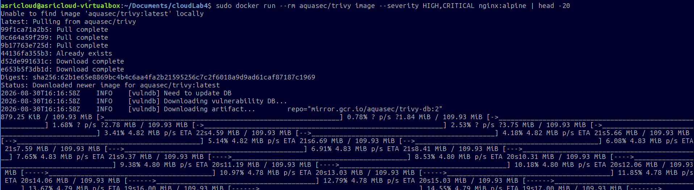

#### Inspection Result

```
User=1000:1000   ReadOnly=true
```

Both the non-root user and read-only filesystem settings were confirmed as active.

---

**Step 3 — Scan the nginx:alpine image for vulnerabilities using Trivy**

```bash
sudo docker run --rm aquasec/trivy image \
  --severity HIGH,CRITICAL nginx:alpine | head -20
```

#### Evidence — `lab_4_13.png`

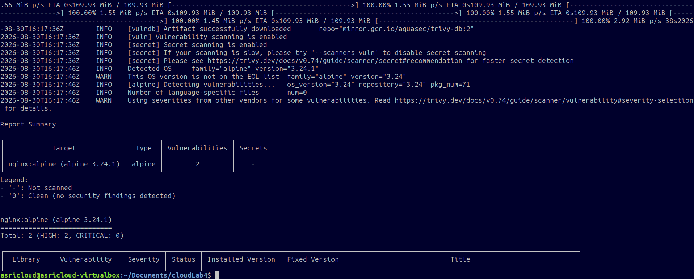

#### Trivy Scan Result

| Target | OS | Vulnerabilities | Secrets |
|---|---|---|---|
| `nginx:alpine (alpine 3.24.1)` | alpine | **2 (HIGH: 2, CRITICAL: 0)** | — |

**Summary from the scan:**
- OS version: Alpine Linux 3.24.1
- Total packages scanned: 71
- **2 HIGH severity vulnerabilities** found — no CRITICAL vulnerabilities
- No secrets detected in the image

> 🔒 **Confidential:** Specific CVE IDs and library version details from the full scan output are not reproduced in this report.

> **Why this matters:** Even official images can contain known vulnerabilities. Running a scanner like Trivy before deploying an image is a critical step in the CI/CD pipeline. Finding 2 HIGH CVEs here means the team should check for a patched base image version before pushing to production. The principle: *never deploy what you haven't scanned.*

---

## 5. Short-Answer Questions

---

### Q1. Explain the difference between authentication and authorization using Tasks 1 and 3.

**Authentication (AuthN)** answers the question *"Who are you?"* — it verifies the identity of a user or system before granting any access. In **Task 1**, HTTP Basic Authentication required the client to present a username (`student`) and a matching password. A request without credentials received a `401 Unauthorized` response — the server refused to process it because it had no way of knowing who was making the request.

**Authorization (AuthZ)** answers the question *"What are you allowed to do?"* — it comes *after* authentication and decides which resources or actions the now-identified user may access. In **Task 3**, after the Kubernetes cluster authenticated the service account `system:serviceaccount:app:dev`, the RBAC rules determined what that account could do. The account was only authorised to `get` and `list` pods. When it tried to `create deploy` or `delete pods`, the API server denied those requests — not because it didn't know who was asking, but because that identity lacked the permission.

**In short:** AuthN is the gatekeeper at the door (checking your ID). AuthZ is the access control system inside (deciding which rooms you can enter once you're in).

---

### Q2. Why is MFA so effective, and which attacks does it defeat?

MFA (Multi-Factor Authentication) is effective because it requires proof from **two different categories** of factors:

| Factor Category | What It Is | Example in Task 2 |
|---|---|---|
| Something you **know** | A password or PIN | The student's password |
| Something you **have** | A device or token | The TOTP secret enrolled in the authenticator app |

Because these factors come from different categories, an attacker must compromise **both independently** — getting one gives them nothing without the other.

**Attacks that MFA defeats:**

| Attack | Why MFA Defeats It |
|---|---|
| **Password phishing** | The attacker gets the password but not the current TOTP code (changes every 30 seconds) |
| **Credential stuffing** | Leaked username/password pairs from other breaches are useless without the TOTP device |
| **Brute-force attacks** | Even if the password is guessed, the attacker cannot generate the correct time-locked code |
| **Password database leaks** | Bcrypt hashes take time to crack — by the time the password is cracked, the TOTP codes have cycled thousands of times |
| **Replay attacks** | Each TOTP code is only valid for ~30 seconds and is single-use; intercepted codes cannot be reused |

> MFA is widely considered the single cheapest and most impactful security control an organisation can deploy. It defeats the majority of automated credential attacks at near-zero cost.

---

### Q3. How does network segmentation limit the damage of a compromised web server?

In **Task 4**, three tiers were deployed across two isolated Docker networks:

```
[web] ─── frontend-net ─── [app] ─── backend-net ─── [db]
```

If the `web` container is fully compromised (e.g., via a web application vulnerability), the attacker gains a shell inside that container. However, because `web` has **no network path to `db`**, they cannot:

- Directly query or dump the database
- Inject SQL or NoSQL commands into the data tier
- Steal customer data from storage

The test proved this: `web → db` returned **BLOCKED**. The attacker would need to **pivot** — first compromise `app`, then use `app`'s network access to reach `db`. Each pivot requires additional effort, introduces additional noise (logs, anomaly detection), and gives defenders more time to detect and respond.

**Key principle:** Segmentation does not prevent compromise, but it **contains lateral movement**. It turns a single breach into a multi-step attack, dramatically reducing the chance of a full data breach from one entry point.

---

### Q4. What does a default-deny firewall policy achieve, and how does it relate to cloud security groups?

A **default-deny policy** (as implemented with `iptables -P INPUT DROP` in Task 5) means:

> *All traffic is blocked unless there is an explicit rule permitting it.*

This is the opposite of a default-allow policy (where everything is permitted unless blocked). The practical effect is:

- **Unknown ports are automatically closed.** A developer who opens a new service on port 8080 does not accidentally expose it — there is no rule permitting port 8080, so it stays blocked.
- **The attack surface shrinks to only what is explicitly listed.** The firewall in Task 5 only permitted HTTPS (443) and loopback — everything else was silently dropped.
- **Misconfiguration fails safe.** If a rule is accidentally removed, traffic stops rather than accidentally opening up.

**Relationship to cloud security groups:**

AWS Security Groups, Azure Network Security Groups, and GCP Firewall Rules all operate on exactly this model. By default, a new security group allows no inbound traffic. Administrators must explicitly add `allow` rules for the ports their application needs. This mirrors the iptables default-deny chain, just managed through a cloud control plane instead of the OS kernel.

> Both approaches embody the same principle: **least privilege for the network** — permit only what is required, deny everything else.

---

### Q5. List the hardening measures applied and the attack surface each one removes.

In **Task 6**, five hardening measures were applied to the `hardened` container. The table below lists each measure, what it does, and the specific attack it mitigates:

| # | Hardening Measure | Docker Flag | Attack Surface Removed |
|---|---|---|---|
| 1 | **Non-root user** | `--user 1000:1000` | If the container is compromised, the attacker runs as UID 1000 — not root. They cannot write to system directories, install packages system-wide, or (in most configurations) break out to the host as root. |
| 2 | **Read-only root filesystem** | `--read-only` | Malware cannot write persistence files, modify existing binaries, or install backdoors. Any attempt to write to the filesystem (outside `/tmp`) fails immediately. |
| 3 | **Drop all Linux capabilities** | `--cap-drop ALL` | Removes powerful kernel-level privileges such as `CAP_NET_ADMIN` (network config), `CAP_SYS_MODULE` (load kernel modules), and `CAP_CHOWN` (change file ownership). An attacker inside the container has far fewer tools to escalate. |
| 4 | **No privilege escalation** | `--security-opt no-new-privileges` | Blocks `setuid` and `setgid` binaries from elevating the process privileges. Even if a `setuid` binary exists in the image (e.g., `sudo`), it cannot grant elevated privileges. |
| 5 | **tmpfs for /tmp** | `--tmpfs /tmp` | Provides a writable in-memory filesystem for the application's temp files without granting write access to persistent storage. Data written here disappears when the container stops — no persistent artefacts left behind. |

**Verification from `docker inspect`:**
```
User=1000:1000   ReadOnly=true
```
Both the non-root user and read-only filesystem were confirmed active after deployment.

**Vulnerability scan summary (Trivy):**
- Image: `nginx:alpine (alpine 3.24.1)`
- Result: **2 HIGH vulnerabilities, 0 CRITICAL**
- Recommendation: Monitor for a patched base image version; avoid deploying with known HIGH CVEs in production.

---

## 6. Security Best-Practices Checklist

| # | Control | Status |
|---|---|---|
| ✅ | Service requires authentication — unauthenticated requests rejected (401) | Done — Task 1 |
| ✅ | MFA / second factor implemented and validated | Done — Task 2 |
| ✅ | Authorization enforced by RBAC — least privilege; unauthorised actions denied | Done — Task 3 |
| ✅ | Network segmented — data tier unreachable from the front tier | Done — Task 4 |
| ✅ | Default-deny firewall with explicit allow rules only | Done — Task 5 |
| ✅ | Container hardened: non-root, capabilities dropped, read-only filesystem | Done — Task 6 |
| ✅ | Container image scanned for vulnerabilities before deployment | Done — Task 6 |

---

## Cleanup Commands

After completing all tasks, the following commands were used to remove all created resources:

```bash
docker rm -f authsvc db app web hardened 2>/dev/null
docker network rm frontend-net backend-net 2>/dev/null
kind delete cluster --name ccse-lab4
```

---

## References

- Course Lectures — Week 5 (Access Control), Week 9 (Network Security Patterns)
- Docker Security Documentation — https://docs.docker.com/engine/security
- CIS Docker / Kubernetes Benchmarks — https://www.cisecurity.org
- CSA Security Guidance v5 — Infrastructure & Networking; IAM
- Trivy Vulnerability Scanner — https://trivy.dev
- NIST SP 800-63B — Digital Identity Guidelines (MFA)

---

*Report prepared based on lab evidence (lab_4_1.png – lab_4_13.png). All sensitive values including password hashes, cryptographic secrets, container IDs, and image digests have been redacted or omitted in accordance with confidentiality requirements.*
