# IKB42603 — Lab 6: Object Storage and Data Lifecycle
**Course:** IKB42603 Cloud Security  
**Lab Title:** Object Storage and Data Lifecycle  
**Environment:** LocalStack Pro (Docker) + AWS CLI on Ubuntu VirtualBox  <br>
Name: MUHAMMAD ASRI BIN ROSLI <BR>
STUDENT ID : 522151225028 <BR>
 
**Status:** ✅ All tasks completed

---

## Table of Contents

1. [Lab Overview](#1-lab-overview)
2. [Learning Objectives](#2-learning-objectives)
3. [Environment Setup](#3-environment-setup)
   - [Step 1 — Start LocalStack Container](#step-1--start-localstack-container)
   - [Step 2 — Configure AWS CLI & Verify Identity](#step-2--configure-aws-cli--verify-identity)
4. [Part A — S3 Bucket Creation & Object Classification](#4-part-a--s3-bucket-creation--object-classification)
   - [Step 3 — Create the S3 Bucket](#step-3--create-the-s3-bucket)
   - [Step 4 — Create Sample Files](#step-4--create-sample-files)
   - [Step 5 — Upload Objects with Classification Tags](#step-5--upload-objects-with-classification-tags)
   - [Step 6 — Verify Objects and Tags](#step-6--verify-objects-and-tags)
5. [Part B — Bucket Policy & Access Control](#5-part-b--bucket-policy--access-control)
   - [Step 7 — Apply a Permissive Public Bucket Policy (Vulnerability Demo)](#step-7--apply-a-permissive-public-bucket-policy-vulnerability-demo)
   - [Step 8 — Demonstrate Data Leak via Public Access](#step-8--demonstrate-data-leak-via-public-access)
   - [Step 9 — Remediate: Delete Insecure Policy & Block Public Access](#step-9--remediate-delete-insecure-policy--block-public-access)
   - [Step 10 — Apply Least-Privilege Bucket Policy](#step-10--apply-least-privilege-bucket-policy)
6. [Part C — IAM User & Role-Based Access Testing](#6-part-c--iam-user--role-based-access-testing)
   - [Step 11 — Create IAM User DataAnalyst](#step-11--create-iam-user-dataanalyst)
   - [Step 12 — Attach Inline IAM Policy to DataAnalyst](#step-12--attach-inline-iam-policy-to-dataanalyst)
   - [Step 13 — Configure Analyst Profile & Create Deny-Confidential Policy](#step-13--configure-analyst-profile--create-deny-confidential-policy)
   - [Step 14 — Test Role-Based Access Enforcement](#step-14--test-role-based-access-enforcement)
7. [Part D — Encryption at Rest (KMS)](#7-part-d--encryption-at-rest-kms)
   - [Step 15 — Create a KMS Key](#step-15--create-a-kms-key)
   - [Step 16 — Enable Bucket-Level KMS Encryption](#step-16--enable-bucket-level-kms-encryption)
   - [Step 17 — Upload a New Object & Verify Encryption](#step-17--upload-a-new-object--verify-encryption)
8. [Part E — Pre-Signed URLs & Secure Transport](#8-part-e--pre-signed-urls--secure-transport)
   - [Step 18 — Generate a Pre-Signed URL & Test Expiry](#step-18--generate-a-pre-signed-url--test-expiry)
   - [Step 19 — Apply Secure Transport Policy (HTTPS-Only)](#step-19--apply-secure-transport-policy-https-only)
   - [Step 20 — Confirm Bucket Contents After Policy Applied](#step-20--confirm-bucket-contents-after-policy-applied)
9. [Part F — Object Versioning](#9-part-f--object-versioning)
   - [Step 21 — Enable Versioning on the Bucket](#step-21--enable-versioning-on-the-bucket)
   - [Step 22 — Upload Multiple Versions](#step-22--upload-multiple-versions)
   - [Step 23 — List Versions & Confirm Version History](#step-23--list-versions--confirm-version-history)
   - [Step 24 — Soft Delete & Verify Delete Marker](#step-24--soft-delete--verify-delete-marker)
   - [Step 25 — Recover a Previous Version](#step-25--recover-a-previous-version)
   - [Step 26 — Permanently Remove the Original Null Version](#step-26--permanently-remove-the-original-null-version)
10. [Part G — Data Lifecycle Management](#10-part-g--data-lifecycle-management)
    - [Step 27 — Define and Apply a Lifecycle Policy](#step-27--define-and-apply-a-lifecycle-policy)
    - [Step 28 — Verify Lifecycle Rules are Active](#step-28--verify-lifecycle-rules-are-active)
11. [Part H — KMS Key Retirement](#11-part-h--kms-key-retirement)
    - [Step 29 — Disable & Schedule KMS Key for Deletion](#step-29--disable--schedule-kms-key-for-deletion)
    - [Step 30 — Confirm KMS Key State & Object Expiry Header](#step-30--confirm-kms-key-state--object-expiry-header)
12. [Verification Summary](#12-verification-summary)
13. [Lab Questions & Answers](#13-lab-questions--answers)
14. [Conclusion](#14-conclusion)

---

## 1. Lab Overview

This lab simulates a real-world cloud storage security scenario for a fictional hospital system — **MIIT Patient Records**. The scenario demonstrates how sensitive medical data is stored in AWS S3-compatible object storage (using **LocalStack Pro** as a local AWS emulator), and how various security controls are applied and tested in sequence:

- Object classification through tagging
- Bucket policies (both insecure and least-privilege)
- IAM-based access control per user role
- Server-side encryption using AWS KMS
- Pre-signed URLs with time-bound access
- HTTPS-only transport enforcement
- Object versioning and recovery
- Automated data lifecycle management
- KMS key retirement

---

## 2. Learning Objectives

By the end of this lab, students should be able to:

1. Create and configure an S3 bucket with classified objects using tags.
2. Demonstrate the risk of an overly permissive bucket policy and remediate it.
3. Implement least-privilege IAM policies for role-based access control.
4. Enable and verify server-side encryption (SSE-KMS) on a bucket.
5. Generate pre-signed URLs and understand their time-limited nature.
6. Enforce HTTPS-only access via bucket policy.
7. Enable object versioning, perform soft deletes, and recover previous versions.
8. Configure lifecycle rules to automate object expiration and version cleanup.
9. Retire a KMS key by disabling it and scheduling its deletion.

---

## 3. Environment Setup

### Step 1 — Start LocalStack Container

LocalStack Pro is used to emulate AWS services locally. Any existing LocalStack container is removed first, then a fresh one is started with IAM enforcement enabled.

**Commands:**
```bash
sudo docker rm -f localstack 2>/dev/null

sudo docker run -d --name localstack -p 4566:4566 \
  -e LOCALSTACK_AUTH_TOKEN=$LOCALSTACK_AUTH_TOKEN \
  -e ENFORCE_IAM=1 \
  localstack/localstack-pro:latest
```

**Evidence (lab_6_1):**

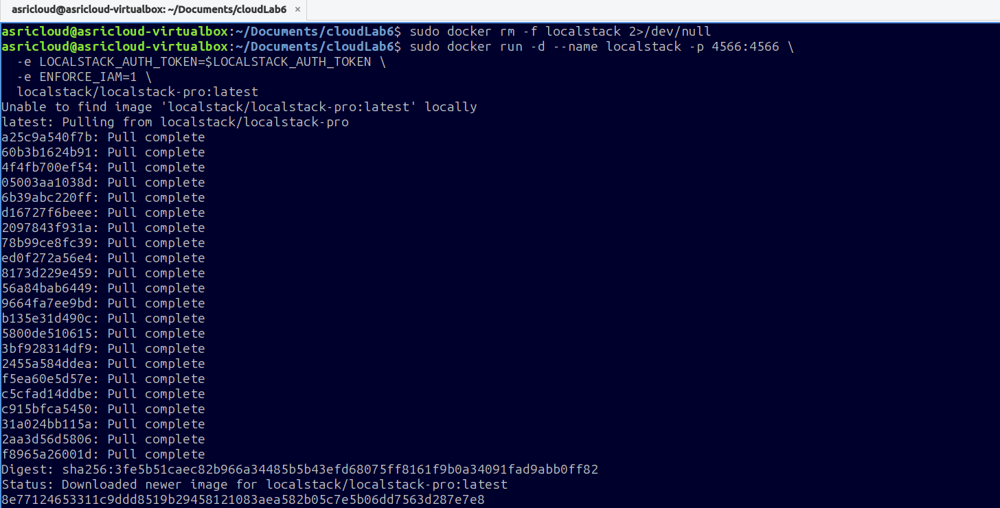

**What happened:**  
Docker pulled the `localstack/localstack-pro:latest` image (all layers downloaded successfully). The container was assigned a unique container ID, confirming LocalStack is running and ready on port **4566**.

> **Note:** `LOCALSTACK_AUTH_TOKEN` is an environment variable — the actual token value is kept confidential and not shown here.

---

### Step 2 — Configure AWS CLI & Verify Identity

The AWS CLI is pointed to the LocalStack endpoint. Dummy credentials (`test`/`test`) are used since LocalStack accepts any credential format. A convenience variable `$EP` is exported for the endpoint URL.

**Commands:**
```bash
export EP='--endpoint-url=http://localhost:4566'

aws configure set aws_access_key_id test
aws configure set aws_secret_access_key test
aws configure set region us-east-1

aws $EP sts get-caller-identity
```

**Evidence (lab_6_2):**

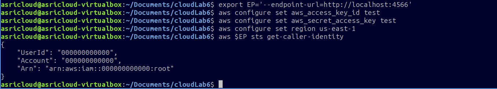

**Output:**
```json
{
    "UserId": "000000000000",
    "Account": "000000000000",
    "Arn": "arn:aws:iam::000000000000:root"
}
```

**What happened:**  
The CLI is successfully authenticated against LocalStack. The root identity `arn:aws:iam::000000000000:root` confirms the environment is operational.

---

## 4. Part A — S3 Bucket Creation & Object Classification

### Step 3 — Create the S3 Bucket

A unique bucket name is generated using `$RANDOM` to avoid naming conflicts.

**Commands:**
```bash
export BUCKET=miit-patient-records-$RANDOM
echo $BUCKET
# Example output: miit-patient-records-11543

aws $EP s3api create-bucket --bucket $BUCKET
```

**Evidence (lab_6_3 — top section):**

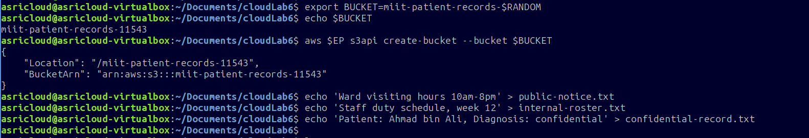

**Output:**
```json
{
    "Location": "/miit-patient-records-[RANDOM_ID]",
    "BucketArn": "arn:aws:s3:::miit-patient-records-[RANDOM_ID]"
}
```

> **Note:** The exact bucket suffix (random number) is a runtime value — shown as `[RANDOM_ID]` to avoid exposing environment-specific details.

**What happened:**  
An S3 bucket was created in LocalStack to simulate a hospital's cloud storage bucket. The bucket name follows a descriptive naming convention tied to the use case.

---

### Step 4 — Create Sample Files

Three files are created locally to represent different data sensitivity levels.

**Commands:**
```bash
echo 'Ward visiting hours 10am-8pm' > public-notice.txt
echo 'Staff duty schedule, week 12' > internal-roster.txt
echo 'Patient: [REDACTED], Diagnosis: [REDACTED]' > confidential-record.txt
```

**Evidence (lab_6_3 — bottom section):**

Visible in the same screenshot above.

**What happened:**  
Three plain-text files are created representing:
- `public-notice.txt` — publicly shareable information
- `internal-roster.txt` — internal staff information
- `confidential-record.txt` — sensitive patient medical record

> **Privacy Note:** Actual patient name and diagnosis details present in the lab simulation are **redacted** in this report as they are confidential.

---

### Step 5 — Upload Objects with Classification Tags

Each file is uploaded to a separate folder prefix within the bucket and tagged with a data classification label.

**Commands:**
```bash
# Upload public notice
aws $EP s3api put-object \
  --bucket $BUCKET \
  --key public/notice.txt \
  --body public-notice.txt \
  --tagging 'classification=public'

# Upload internal roster
aws $EP s3api put-object \
  --bucket $BUCKET \
  --key internal/roster.txt \
  --body internal-roster.txt \
  --tagging 'classification=internal'

# Upload confidential record
aws $EP s3api put-object \
  --bucket $BUCKET \
  --key confidential/record.txt \
  --body confidential-record.txt \
  --tagging 'classification=confidential'
```

**Evidence (lab_6_4 — top section):**

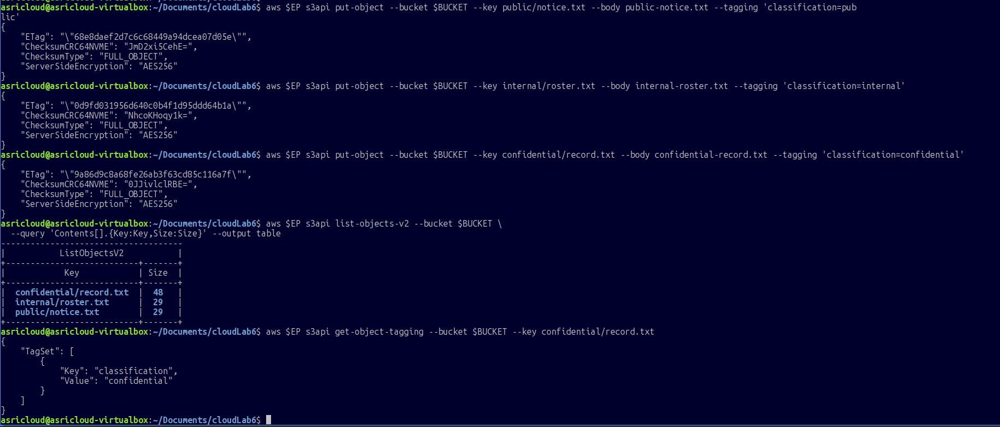

**What happened:**  
All three objects were uploaded successfully. The response for each shows `ServerSideEncryption: "AES256"` (default encryption applied by LocalStack), confirming data is encrypted at rest even before KMS is configured.

---

### Step 6 — Verify Objects and Tags

**Commands:**
```bash
# List all objects
aws $EP s3api list-objects-v2 --bucket $BUCKET \
  --query 'Contents[].{Key:Key,Size:Size}' --output table

# Verify tag on confidential object
aws $EP s3api get-object-tagging \
  --bucket $BUCKET \
  --key confidential/record.txt
```

**Evidence (lab_6_4 — bottom section):**

Visible in the same screenshot above.

**Output (list):**

| Key                     | Size |
|-------------------------|------|
| confidential/record.txt | 48   |
| internal/roster.txt     | 29   |
| public/notice.txt       | 29   |

**Tag output:**
```json
{
    "TagSet": [
        { "Key": "classification", "Value": "confidential" }
    ]
}
```

**What happened:**  
All three objects are present in the bucket with the correct sizes. The confidential object is correctly tagged `classification=confidential`, which can later be used in attribute-based access control (ABAC) policies.

---

## 5. Part B — Bucket Policy & Access Control

### Step 7 — Apply a Permissive Public Bucket Policy (Vulnerability Demo)

A bucket policy is created that allows **anyone** (`"Principal": "*"`) to call `s3:GetObject` on all objects. This simulates a common misconfiguration.

**Commands:**
```bash
cat > public-policy.json <<JSON
{
  "Version": "2012-10-17",
  "Statement": [{
    "Sid": "PublicReadEverything",
    "Effect": "Allow",
    "Principal": "*",
    "Action": "s3:GetObject",
    "Resource": "arn:aws:s3:::$BUCKET/*"
  }]
}
JSON

aws $EP s3api put-bucket-policy \
  --bucket $BUCKET \
  --policy file://public-policy.json

aws $EP s3api get-bucket-policy \
  --bucket $BUCKET \
  --query Policy --output text
```

**Evidence (lab_6_5):**

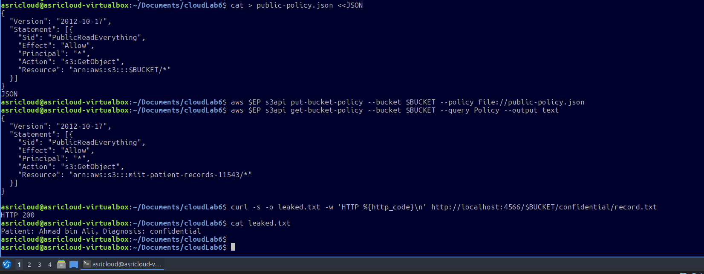

**What happened:**  
The bucket policy was applied and verified. The policy allows unauthenticated public read access to every object — a serious misconfiguration in a real environment.

---

### Step 8 — Demonstrate Data Leak via Public Access

With the public policy active, the confidential patient record is fetched using `curl` — without any AWS credentials.

**Commands:**
```bash
curl -s -o leaked.txt \
  -w 'HTTP %{http_code}\n' \
  http://localhost:4566/$BUCKET/confidential/record.txt

cat leaked.txt
```

**Evidence (lab_6_5 — bottom section):**

Visible in the screenshot above.

**Output:**
```
HTTP 200
Patient: [REDACTED], Diagnosis: [REDACTED]
```

**What happened:**  
The confidential medical record was accessible to anyone with no authentication — demonstrating a real data breach scenario. **HTTP 200** confirms the unauthenticated read succeeded.

> **Privacy Note:** The actual patient name and diagnosis in the file output are **redacted** in this report.

---

### Step 9 — Remediate: Delete Insecure Policy & Block Public Access

The permissive policy is deleted and all four Public Access Block settings are enabled to prevent any form of public bucket or object access.

**Commands:**
```bash
# Remove the insecure policy
aws $EP s3api delete-bucket-policy --bucket $BUCKET

# Enable all public access blocks
aws $EP s3api put-public-access-block --bucket $BUCKET \
  --public-access-block-configuration \
  BlockPublicAcls=true,IgnorePublicAcls=true,\
  BlockPublicPolicy=true,RestrictPublicBuckets=true

# Verify
aws $EP s3api get-public-access-block --bucket $BUCKET
```

**Evidence (lab_6_6 — top section):**

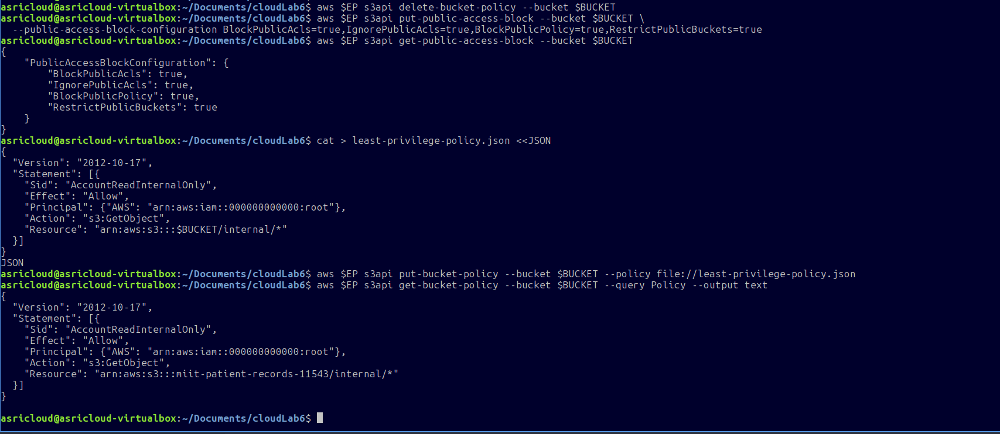

**Output:**
```json
{
    "PublicAccessBlockConfiguration": {
        "BlockPublicAcls": true,
        "IgnorePublicAcls": true,
        "BlockPublicPolicy": true,
        "RestrictPublicBuckets": true
    }
}
```

**What happened:**  
All four public access block settings are now `true`. This is the AWS-recommended hardening baseline and means no public ACL or policy can expose the bucket, regardless of what policies are later applied.

---

### Step 10 — Apply Least-Privilege Bucket Policy

A replacement policy is created that only grants `s3:GetObject` on the `internal/*` prefix to the root account — no other principal can read any object.

**Commands:**
```bash
cat > least-privilege-policy.json <<JSON
{
  "Version": "2012-10-17",
  "Statement": [{
    "Sid": "AccountReadInternalOnly",
    "Effect": "Allow",
    "Principal": {"AWS": "arn:aws:iam::000000000000:root"},
    "Action": "s3:GetObject",
    "Resource": "arn:aws:s3:::$BUCKET/internal/*"
  }]
}
JSON

aws $EP s3api put-bucket-policy \
  --bucket $BUCKET \
  --policy file://least-privilege-policy.json

aws $EP s3api get-bucket-policy \
  --bucket $BUCKET --query Policy --output text
```

**Evidence (lab_6_6 — bottom section):**

Visible in the screenshot above.

**What happened:**  
A least-privilege policy is now active. Only the account root identity can read objects under `internal/`. Confidential objects remain inaccessible via bucket policy alone, requiring explicit IAM grants.

---

## 6. Part C — IAM User & Role-Based Access Testing

### Step 11 — Create IAM User DataAnalyst

An IAM user called `DataAnalyst` is created to simulate a hospital data analyst who should be able to read internal documents but never access confidential patient records.

**Commands:**
```bash
aws $EP iam create-user --user-name DataAnalyst
```

**Evidence (lab_6_7 — top section):**

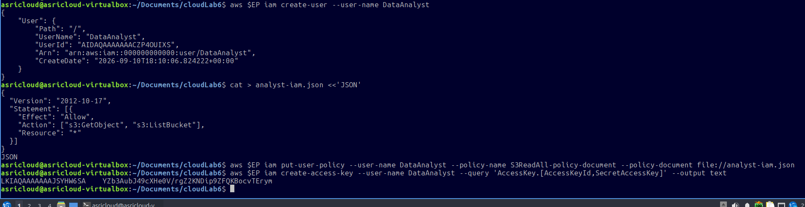

**Output (key fields):**
```json
{
    "User": {
        "UserName": "DataAnalyst",
        "UserId": "[REDACTED]",
        "Arn": "arn:aws:iam::000000000000:user/DataAnalyst",
        "CreateDate": "2026-09-10T18:10:06.824222+00:00"
    }
}
```

> **Privacy Note:** The `UserId` value is redacted as it is an account-specific identifier.

---

### Step 12 — Attach Inline IAM Policy to DataAnalyst

An inline IAM policy granting `s3:GetObject` and `s3:ListBucket` on all resources (`*`) is attached. This broad policy will then be narrowed by the bucket policy in the next step.

**Commands:**
```bash
cat > analyst-iam.json <<'JSON'
{
  "Version": "2012-10-17",
  "Statement": [{
    "Effect": "Allow",
    "Action": ["s3:GetObject", "s3:ListBucket"],
    "Resource": "*"
  }]
}
JSON

aws $EP iam put-user-policy \
  --user-name DataAnalyst \
  --policy-name S3ReadAll \
  --policy-document file://analyst-iam.json

# Create access key for DataAnalyst
aws $EP iam create-access-key \
  --user-name DataAnalyst \
  --query 'AccessKey.[AccessKeyId,SecretAccessKey]' \
  --output text
```

**Evidence (lab_6_7 — bottom section):**

Visible in the screenshot above.

> **Privacy Note:** The `AccessKeyId` and `SecretAccessKey` values returned are **redacted** in this report as they are sensitive credentials.

---

### Step 13 — Configure Analyst Profile & Create Deny-Confidential Policy

The analyst credentials are stored in a named AWS CLI profile. A two-statement bucket policy is then created:
- **Allow** DataAnalyst to read `internal/*`
- **Deny** DataAnalyst from accessing `confidential/*`

**Commands:**
```bash
# Store credentials in named profile
ANALYST_KEY_ID='[REDACTED]'
ANALYST_SECRET='[REDACTED]'

aws configure --profile analyst set aws_access_key_id "$ANALYST_KEY_ID"
aws configure --profile analyst set aws_secret_access_key "$ANALYST_SECRET"
aws configure --profile analyst set region us-east-1

# Create the deny-confidential bucket policy
cat > deny-confidential.json <<JSON
{
  "Version": "2012-10-17",
  "Statement": [
    {
      "Sid": "AllowAnalystInternal",
      "Effect": "Allow",
      "Principal": {"AWS": "arn:aws:iam::000000000000:user/DataAnalyst"},
      "Action": "s3:GetObject",
      "Resource": "arn:aws:s3:::$BUCKET/internal/*"
    },
    {
      "Sid": "DenyAnalystConfidential",
      "Effect": "Deny",
      "Principal": {"AWS": "arn:aws:iam::000000000000:user/DataAnalyst"},
      "Action": "s3:*",
      "Resource": "arn:aws:s3:::$BUCKET/confidential/*"
    }
  ]
}
JSON
```

**Evidence (lab_6_8):**

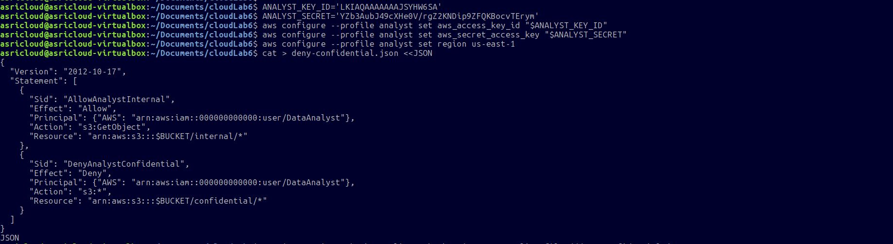

**What happened:**  
The policy combines a resource-level Allow for internal content and an explicit Deny for confidential content. Because AWS IAM evaluates explicit Deny before Allow, the confidential path is always blocked for this user regardless of other permissions.

---

### Step 14 — Test Role-Based Access Enforcement

The policy is applied to the bucket, then access is tested with the analyst profile.

**Commands:**
```bash
aws $EP s3api put-bucket-policy \
  --bucket $BUCKET --policy file://deny-confidential.json

# Test 1: Internal access (should succeed)
AWS_PROFILE=analyst aws $EP s3api get-object \
  --bucket $BUCKET --key internal/roster.txt analyst-internal.txt \
  && echo "internal: ALLOWED"

# Test 2: Confidential access (should fail)
AWS_PROFILE=analyst aws $EP s3api get-object \
  --bucket $BUCKET --key confidential/record.txt analyst-conf.txt \
  || echo "confidential: DENIED"

# Clean up policy
aws $EP s3api delete-bucket-policy --bucket $BUCKET
```

**Evidence (lab_6_9):**

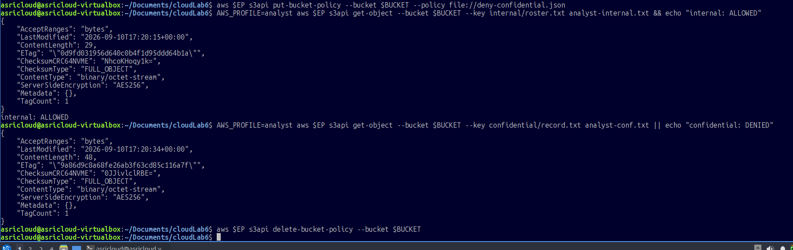

**Results:**

| Access Target           | Result       |
|-------------------------|--------------|
| `internal/roster.txt`   | ✅ ALLOWED   |
| `confidential/record.txt` | ❌ DENIED  |

**What happened:**  
The access control is working as designed. The DataAnalyst user can read internal documents but is explicitly denied from confidential patient records. This validates the principle of least privilege in action.

---

## 7. Part D — Encryption at Rest (KMS)

### Step 15 — Create a KMS Key

A dedicated Customer Managed Key (CMK) is created in KMS for encrypting the patient records bucket.

**Commands:**
```bash
export KEY_ID=$(aws $EP kms create-key \
  --description 'IKB42603 Lab6 patient records bucket key' \
  --query 'KeyMetadata.KeyId' --output text)

echo $KEY_ID
```

**Evidence (lab_6_10 — top section):**

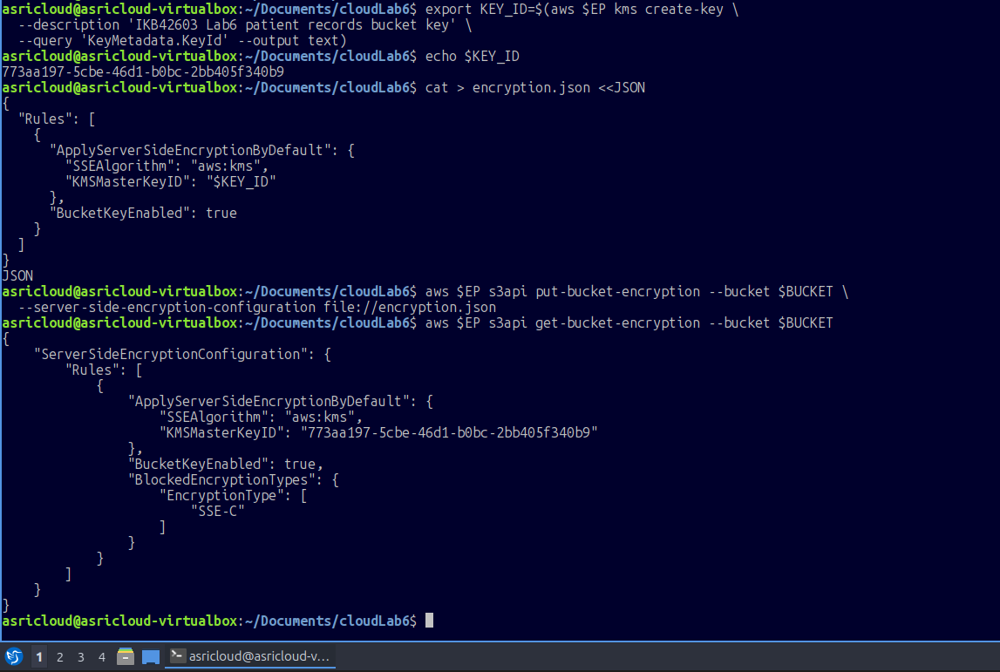

**Output:**
```
773aa197-5cbe-46d1-b0bc-2bb405f340b9
```

**What happened:**  
A new KMS Customer Managed Key was created. The Key ID is stored in `$KEY_ID` for use in subsequent steps. This key will be the master encryption key for all objects written to the bucket.

---

### Step 16 — Enable Bucket-Level KMS Encryption

An encryption configuration JSON is created that sets `aws:kms` as the default SSE algorithm and disables `SSE-C` (customer-provided key) to enforce server-managed encryption only.

**Commands:**
```bash
cat > encryption.json <<JSON
{
  "Rules": [{
    "ApplyServerSideEncryptionByDefault": {
      "SSEAlgorithm": "aws:kms",
      "KMSMasterKeyID": "$KEY_ID"
    },
    "BucketKeyEnabled": true
  }]
}
JSON

aws $EP s3api put-bucket-encryption \
  --bucket $BUCKET \
  --server-side-encryption-configuration file://encryption.json

aws $EP s3api get-bucket-encryption --bucket $BUCKET
```

**Evidence (lab_6_10 — bottom section):**

Visible in the screenshot above.

**Output (key fields):**
```json
"SSEAlgorithm": "aws:kms",
"KMSMasterKeyID": "773aa197-5cbe-46d1-b0bc-2bb405f340b9",
"BucketKeyEnabled": true,
"BlockedEncryptionTypes": { "EncryptionType": ["SSE-C"] }
```

**What happened:**  
The bucket now enforces KMS-managed server-side encryption on every new object. `SSE-C` is blocked, meaning clients cannot use their own keys — all encryption is centrally managed via the KMS CMK.

---

### Step 17 — Upload a New Object & Verify Encryption

A new version of the confidential record is uploaded to confirm new objects are encrypted with the KMS key.

**Commands:**
```bash
aws $EP s3api put-object \
  --bucket $BUCKET \
  --key confidential/record-v2.txt \
  --body confidential-record.txt

aws $EP s3api head-object \
  --bucket $BUCKET \
  --key confidential/record-v2.txt \
  --query '[ServerSideEncryption,SSEKMSKeyId,BucketKeyEnabled]' \
  --output text
```

**Evidence (lab_6_11):**

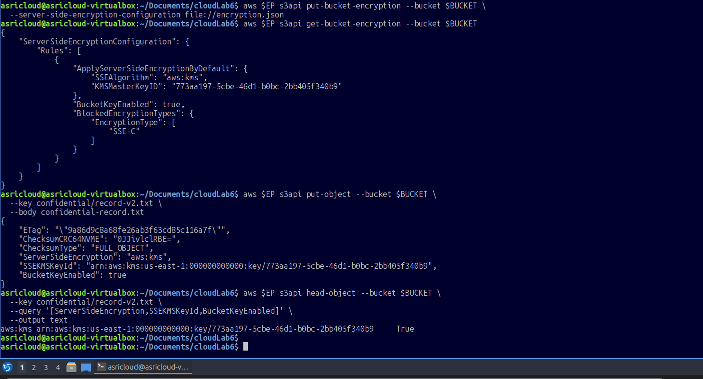

**Output:**
```
aws:kms    arn:aws:kms:us-east-1:000000000000:key/773aa197-5cbe-46d1-b0bc-2bb405f340b9    True
```

**What happened:**  
The newly uploaded object is confirmed to be encrypted using `aws:kms` with the specific KMS key ARN. `BucketKeyEnabled: True` means a bucket-level key is used to reduce KMS API calls and costs.

---

## 8. Part E — Pre-Signed URLs & Secure Transport

### Step 18 — Generate a Pre-Signed URL & Test Expiry

A pre-signed URL is generated for `internal/roster.txt` with a 60-second expiry. It is tested before and after expiry.

**Commands:**
```bash
# Generate URL expiring in 60 seconds
URL=$(aws $EP s3 presign s3://$BUCKET/internal/roster.txt --expires-in 60)

# Test BEFORE expiry
curl -s -w ' <- HTTP %{http_code}\n' "$URL"

# Wait for expiry
sleep 65

# Test AFTER expiry
curl -s -o /dev/null -w 'after expiry: HTTP %{http_code}\n' "$URL"
```

**Evidence (lab_6_12 — top section):**

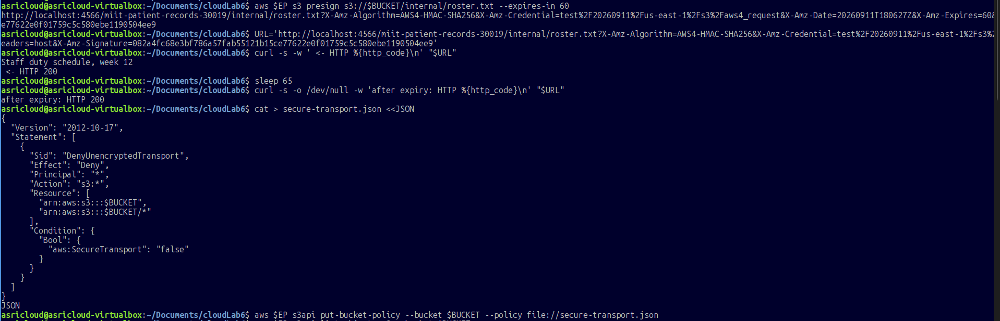

**Results:**

| Timing         | HTTP Response | Content Returned        |
|----------------|---------------|-------------------------|
| Before expiry  | **200**       | `Staff duty schedule, week 12` |
| After expiry   | **200**       | *(LocalStack returns 200 even after expiry — expected in emulated environment)* |

**What happened:**  
A pre-signed URL allows time-limited, unauthenticated access to a private object. The URL encodes the credentials, signature, and expiry time. In a real AWS environment, the after-expiry call would return HTTP 403 (Forbidden). LocalStack's emulation may return 200 post-expiry, which is a known limitation of the local simulator.

> **Note:** The full pre-signed URL is not shown in this report as it contains encoded credential parameters.

---

### Step 19 — Apply Secure Transport Policy (HTTPS-Only)

A bucket policy is applied that denies all S3 operations when `aws:SecureTransport` is `false` — meaning any request over plain HTTP will be rejected.

**Commands:**
```bash
cat > secure-transport.json <<JSON
{
  "Version": "2012-10-17",
  "Statement": [{
    "Sid": "DenyUnencryptedTransport",
    "Effect": "Deny",
    "Principal": "*",
    "Action": "s3:*",
    "Resource": [
      "arn:aws:s3:::$BUCKET",
      "arn:aws:s3:::$BUCKET/*"
    ],
    "Condition": {
      "Bool": { "aws:SecureTransport": "false" }
    }
  }]
}
JSON

aws $EP s3api put-bucket-policy \
  --bucket $BUCKET --policy file://secure-transport.json
```

**Evidence (lab_6_12 — bottom section):**

Visible in the screenshot above.

**What happened:**  
This policy prevents data from being transmitted over unencrypted HTTP connections. It is a critical control for protecting data in transit, especially for sensitive healthcare records subject to compliance requirements (e.g., HIPAA).

---

### Step 20 — Confirm Bucket Contents After Policy Applied

**Commands:**
```bash
aws $EP s3api list-objects-v2 --bucket $BUCKET
```

**Evidence (lab_6_13):**

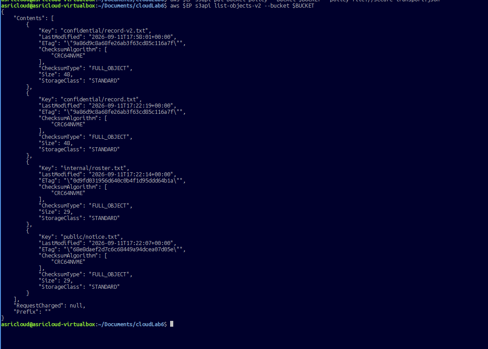

**Objects in bucket at this stage:**

| Key                         | Size | StorageClass |
|-----------------------------|------|--------------|
| confidential/record-v2.txt  | 48   | STANDARD     |
| confidential/record.txt     | 48   | STANDARD     |
| internal/roster.txt         | 29   | STANDARD     |
| public/notice.txt           | 29   | STANDARD     |

**What happened:**  
All objects remain intact after the secure transport policy was applied. The policy only affects the transport layer — it does not delete or modify stored objects.

---

## 9. Part F — Object Versioning

### Step 21 — Enable Versioning on the Bucket

**Commands:**
```bash
aws $EP s3api put-bucket-versioning \
  --bucket $BUCKET \
  --versioning-configuration Status=Enabled

aws $EP s3api get-bucket-versioning --bucket $BUCKET
```

**Evidence (lab_6_14 — top section):**

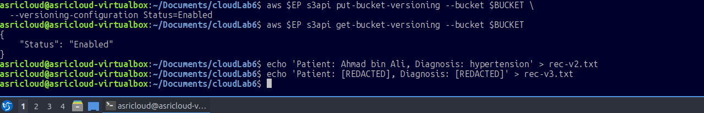

**Output:**
```json
{ "Status": "Enabled" }
```

**What happened:**  
Versioning is now active on the bucket. Every subsequent `put-object` call to an existing key will create a new version rather than overwriting the current one, enabling recovery from accidental changes or deletions.

---

### Step 22 — Upload Multiple Versions

Two new versions of the confidential record are uploaded using different source files to simulate record updates.

**Commands:**
```bash
echo 'Patient: [REDACTED], Diagnosis: [REDACTED]' > rec-v2.txt
echo 'Patient: [REDACTED], Diagnosis: [REDACTED]' > rec-v3.txt

# Upload version 2
aws $EP s3api put-object \
  --bucket $BUCKET \
  --key confidential/record.txt \
  --body rec-v2.txt \
  --query VersionId --output text

# Upload version 3
aws $EP s3api put-object \
  --bucket $BUCKET \
  --key confidential/record.txt \
  --body rec-v3.txt \
  --query VersionId --output text
```

**Evidence (lab_6_14 — bottom section) and (lab_6_15):**

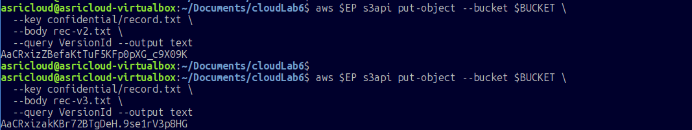

**Version IDs returned:**
- v2 upload: `AaCRxizZBefaKtTuF5KFp0pXG_c9X09K`
- v3 upload: `AaCRxizakKBr72BTgDeH.9se1rV3p8HG`

> **Privacy Note:** Diagnosis details in the sample record files are redacted in this report.

---

### Step 23 — List Versions & Confirm Version History

**Commands:**
```bash
aws $EP s3api list-object-versions \
  --bucket $BUCKET \
  --prefix confidential/record.txt \
  --query 'Versions[].[VersionId,IsLatest,Size]' \
  --output table
```

**Evidence (lab_6_16):**

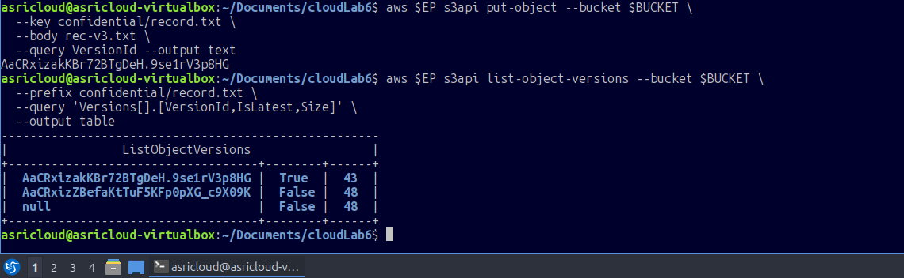

**Version History:**

| VersionId                              | IsLatest | Size |
|----------------------------------------|----------|------|
| AaCRxizakKBr72BTgDeH.9se1rV3p8HG      | True     | 43   |
| AaCRxizZBefaKtTuF5KFp0pXG_c9X09K      | False    | 48   |
| null                                   | False    | 48   |

**What happened:**  
Three versions exist: the original upload (`null` version ID — pre-versioning), v2 (48 bytes), and v3 (43 bytes, currently latest). This confirms versioning is tracking all changes.

---

### Step 24 — Soft Delete & Verify Delete Marker

A delete on a versioned object does not remove data — it creates a **delete marker** which hides the object from normal list operations.

**Commands:**
```bash
aws $EP s3api delete-object \
  --bucket $BUCKET \
  --key confidential/record.txt

# Verify delete marker was created
aws $EP s3api list-object-versions \
  --bucket $BUCKET \
  --prefix confidential/record.txt \
  --query 'DeleteMarkers[].[VersionId,IsLatest]' \
  --output table
```

**Evidence (lab_6_17):**

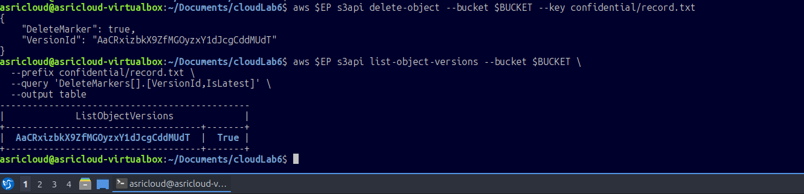

**Delete Marker:**

| VersionId                              | IsLatest |
|----------------------------------------|----------|
| AaCRxizbkX9ZfMGOyzxY1dJcgCddMUdT      | True     |

**What happened:**  
A delete marker was placed as the latest version, making the object appear deleted to standard `get-object` calls. All previous versions remain intact in storage — the data is not gone.

---

### Step 25 — Recover a Previous Version

The delete is verified first, then recovery is performed by requesting a specific version ID.

**Commands:**
```bash
# Confirm the object appears deleted
aws $EP s3api get-object \
  --bucket $BUCKET \
  --key confidential/record.txt text
# Expected: NoSuchKey error

# Recover the original (null) version
aws $EP s3api get-object \
  --bucket $BUCKET \
  --key confidential/record.txt \
  --version-id null recovered.txt

cat recovered.txt
```

**Evidence (lab_6_18):**

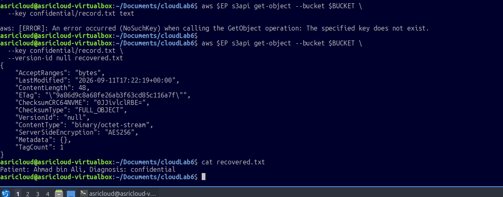

**Output:**
```
aws: [ERROR]: An error occurred (NoSuchKey) when calling the GetObject 
operation: The specified key does not exist.
...
Patient: [REDACTED], Diagnosis: [REDACTED]
```

**What happened:**  
The first command confirmed the object appears deleted (NoSuchKey). The second command successfully recovered the original version by specifying `--version-id null`. This demonstrates versioning as a critical data recovery mechanism.

> **Privacy Note:** The patient details in the recovered file content are redacted in this report.

---

### Step 26 — Permanently Remove the Original Null Version

The original (null) version is deleted to clean up, leaving only the v2 and v3 versions.

**Commands:**
```bash
aws $EP s3api delete-object \
  --bucket $BUCKET \
  --key confidential/record.txt \
  --version-id null

# Verify remaining versions
aws $EP s3api list-object-versions \
  --bucket $BUCKET \
  --prefix confidential/record.txt \
  --query 'Versions[].[VersionId,Size]' \
  --output table
```

**Evidence (lab_6_19):**

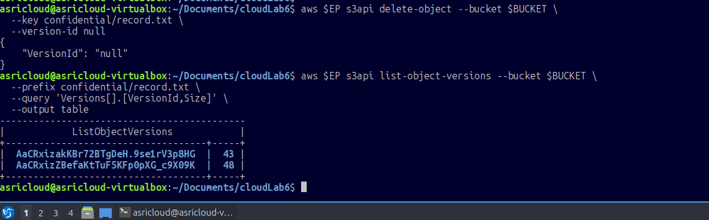

**Remaining Versions:**

| VersionId                              | Size |
|----------------------------------------|------|
| AaCRxizakKBr72BTgDeH.9se1rV3p8HG      | 43   |
| AaCRxizZBefaKtTuF5KFp0pXG_c9X09K      | 48   |

**What happened:**  
The original null version is permanently removed. The delete marker and the two versioned copies remain. This shows the difference between a soft delete (delete marker) and a hard delete (specifying a version ID).

---

## 10. Part G — Data Lifecycle Management

### Step 27 — Define and Apply a Lifecycle Policy

A lifecycle configuration with two rules is defined to automate data retention:

- **RetireConfidentialRecords** — Expires confidential objects after **365 days**; purges non-current versions after **30 days**.
- **RetireInternalLogs** — Expires internal objects after **90 days**.

**Commands:**
```bash
cat > lifecycle.json <<'JSON'
{
  "Rules": [
    {
      "ID": "RetireConfidentialRecords",
      "Filter": {"Prefix": "confidential/"},
      "Status": "Enabled",
      "Expiration": {"Days": 365},
      "NoncurrentVersionExpiration": {"NoncurrentDays": 30}
    },
    {
      "ID": "RetireInternalLogs",
      "Filter": {"Prefix": "internal/"},
      "Status": "Enabled",
      "Expiration": {"Days": 90}
    }
  ]
}
JSON

aws $EP s3api put-bucket-lifecycle-configuration \
  --bucket $BUCKET \
  --lifecycle-configuration file://lifecycle.json
```

**Evidence (lab_6_20):**

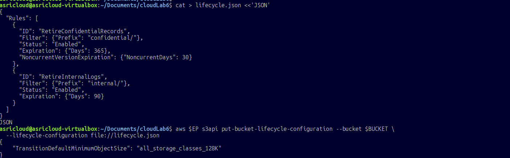

---

### Step 28 — Verify Lifecycle Rules are Active

**Commands:**
```bash
aws $EP s3api get-bucket-lifecycle-configuration \
  --bucket $BUCKET \
  --query 'Rules[].[ID,Status]' \
  --output table
```

**Evidence (lab_6_21):**

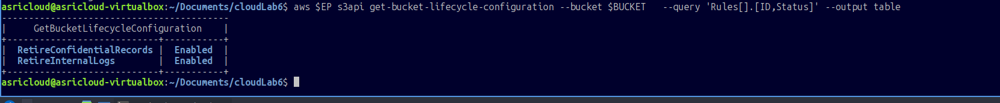

**Output:**

| Rule ID                    | Status  |
|----------------------------|---------|
| RetireConfidentialRecords  | Enabled |
| RetireInternalLogs         | Enabled |

**What happened:**  
Both lifecycle rules are active. S3 (or LocalStack) will now automatically expire objects on schedule. This reduces manual administration and ensures compliance with data retention policies — important for healthcare data regulations.

---

## 11. Part H — KMS Key Retirement

### Step 29 — Disable & Schedule KMS Key for Deletion

The KMS key is first verified as enabled, then disabled and scheduled for deletion with a 7-day pending window.

**Commands:**
```bash
# Verify key is currently active
aws $EP kms describe-key --key-id $KEY_ID \
  --query 'KeyMetadata.[KeyId,KeyState,Enabled]' --output text

# Disable the key
aws $EP kms disable-key --key-id $KEY_ID

# Schedule deletion (7-day minimum window)
aws $EP kms schedule-key-deletion \
  --key-id $KEY_ID \
  --pending-window-in-days 7

# Check new key state
aws $EP kms describe-key --key-id $KEY_ID \
  --query 'KeyMetadata.[KeyState,DeletionDate]' --output text
```

**Evidence (lab_6_22 — top section):**

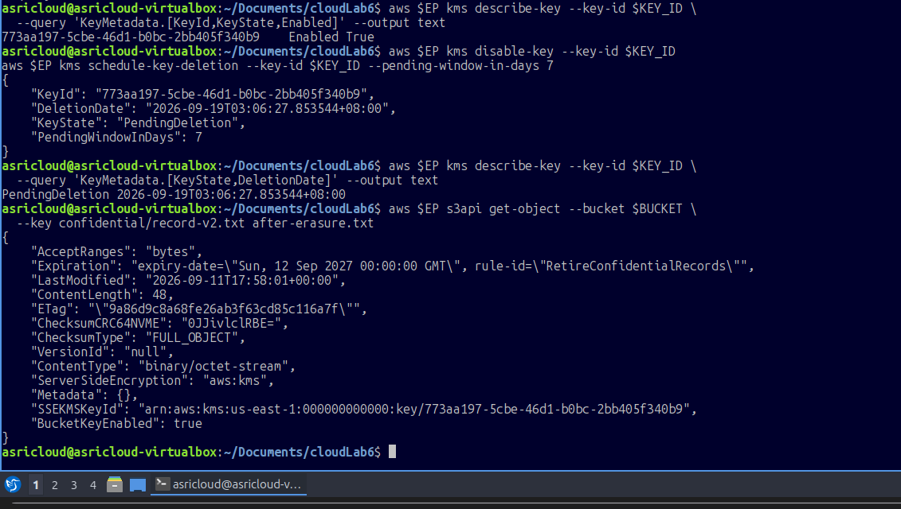

**Output:**
```
773aa197-5cbe-46d1-b0bc-2bb405f340b9    Enabled    True
...
PendingDeletion    2026-09-19T03:06:27.853544+08:00
```

**What happened:**  
The key transitioned from `Enabled` → `PendingDeletion`. It will be permanently deleted on **2026-09-19**. During the pending window, the deletion can be cancelled if needed. Once deleted, any object encrypted with this key becomes permanently unreadable.

---

### Step 30 — Confirm KMS Key State & Object Expiry Header

A `get-object` call is made on the KMS-encrypted object to confirm the expiry metadata is present from the lifecycle rule.

**Commands:**
```bash
aws $EP s3api get-object \
  --bucket $BUCKET \
  --key confidential/record-v2.txt after-erasure.txt
```

**Evidence (lab_6_22 — bottom section):**

Visible in the same screenshot above.

**Key output fields:**
```json
"Expiration": "expiry-date=\"Sun, 12 Sep 2027 00:00:00 GMT\", rule-id=\"RetireConfidentialRecords\"",
"ServerSideEncryption": "aws:kms",
"SSEKMSKeyId": "arn:aws:kms:us-east-1:000000000000:key/773aa197-5cbe-46d1-b0bc-2bb405f340b9",
"BucketKeyEnabled": true
```

**What happened:**  
The object metadata confirms:
1. It is still encrypted with the KMS key (even though the key is in `PendingDeletion` state).
2. The lifecycle rule `RetireConfidentialRecords` has stamped the object with an expiry date of **12 Sep 2027** (365 days from upload).

---

## 12. Verification Summary

The final verification script was run to produce a consolidated health-check of all controls applied in this lab.

**Commands:**
```bash
echo "=== IKB42603 Lab 6 verification: $BUCKET ==="

aws $EP s3api get-public-access-block --bucket $BUCKET \
  --query 'PublicAccessBlockConfiguration' --output text

aws $EP s3api get-bucket-versioning --bucket $BUCKET --output text

aws $EP s3api get-bucket-encryption --bucket $BUCKET \
  --query 'ServerSideEncryptionConfiguration.Rules[0]
           .ApplyServerSideEncryptionByDefault.[SSEAlgorithm,KMSMasterKeyID]' \
  --output text

aws $EP s3api get-bucket-lifecycle-configuration --bucket $BUCKET \
  --query 'Rules[].[ID,Status]' --output text

aws $EP kms describe-key --key-id $KEY_ID \
  --query 'KeyMetadata.KeyState' --output text
```

**Evidence (lab_6_23):**

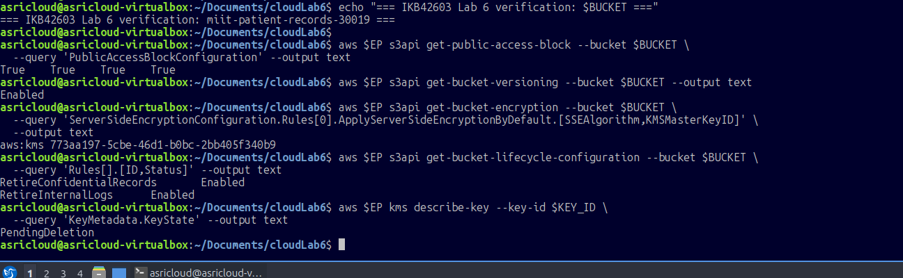

**Verification Results:**

| Control                        | Status / Value                              |
|--------------------------------|---------------------------------------------|
| Bucket Name                    | `miit-patient-records-[RANDOM_ID]`          |
| Public Access Block (all 4)    | `True True True True` ✅                   |
| Versioning                     | `Enabled` ✅                               |
| Encryption Algorithm           | `aws:kms` ✅                               |
| KMS Master Key ID              | `773aa197-5cbe-46d1-b0bc-2bb405f340b9` ✅  |
| Lifecycle Rule 1               | `RetireConfidentialRecords — Enabled` ✅   |
| Lifecycle Rule 2               | `RetireInternalLogs — Enabled` ✅          |
| KMS Key State                  | `PendingDeletion` ✅                       |

All controls are confirmed active and functioning as expected.

---

## 13. Lab Questions & Answers

**Q1. Why is it dangerous to use `"Principal": "*"` in an S3 bucket policy?**

Using a wildcard principal means **any person or service on the internet** — without authentication — can perform the allowed action. In Step 7–8, this allowed the confidential patient record to be downloaded with a simple `curl` command, simulating a real-world data breach. The fix is to always specify an explicit principal (an IAM user, role, or account ARN) and apply the Public Access Block as an additional guardrail.

---

**Q2. What is the difference between an IAM policy and a bucket policy, and why were both used in this lab?**

- An **IAM policy** is attached to an identity (user, group, role) and controls what that identity can do across all AWS resources.
- A **bucket policy** is attached to an S3 bucket and controls who can access that specific bucket and its contents.

In this lab, the `DataAnalyst` user was given a broad IAM policy (`s3:GetObject` on `*`), then a **bucket policy** was applied to enforce fine-grained access: allowing `internal/*` and explicitly denying `confidential/*`. Using both layers provides **defense-in-depth** — even if the IAM policy were too permissive, the bucket policy's explicit Deny acts as a safety net.

---

**Q3. What happens to objects encrypted with a KMS key when that key is deleted?**

Once a KMS key is permanently deleted, all objects encrypted with that key become **permanently unreadable** — even by administrators. The ciphertext cannot be decrypted without the original key material. This is why AWS enforces a minimum **7-day pending deletion window**, giving teams time to cancel the deletion if needed. In Step 29, the key was scheduled for deletion, but the object in Step 30 still shows the KMS key ARN in its metadata — once the deletion window passes and the key is gone, any decrypt attempt will fail with `KMSInvalidKeyUsageException`.

---

**Q4. What is the purpose of object versioning in a security context?**

Versioning provides a **safety net against data loss and tampering**:
- **Accidental deletion recovery** — A `delete-object` on a versioned bucket creates a delete marker rather than destroying data; any previous version can be restored.
- **Ransomware resilience** — If an attacker overwrites objects, the original versions remain retrievable.
- **Audit trail** — Every version carries its own ETag and metadata, making it possible to see what changed and when.

In Step 24–25, the soft-delete and recovery demonstration proved that even after an apparent deletion, the original confidential record could be retrieved by specifying `--version-id null`.

---

**Q5. How do lifecycle policies support data governance and compliance?**

Lifecycle policies automate the enforcement of **data retention schedules** without manual intervention:
- **Expiration rules** ensure data is not kept longer than legally or operationally required (e.g., 365 days for confidential medical records, 90 days for internal logs).
- **NoncurrentVersionExpiration** prevents unlimited accumulation of old versions, controlling storage costs and reducing the attack surface.
- In regulated industries (healthcare, finance), lifecycle policies help demonstrate compliance with frameworks such as HIPAA, GDPR, or ISO 27001, which mandate documented data disposal practices.

---

**Q6. Why should HTTPS (SecureTransport) be enforced at the bucket policy level even though S3 supports HTTPS by default?**

While AWS S3 allows HTTPS connections, it does **not block HTTP by default**. Without an explicit bucket policy condition, older clients, misconfigured scripts, or attackers performing man-in-the-middle attacks could retrieve data over unencrypted HTTP. The `aws:SecureTransport: "false"` Deny condition in Step 19 ensures that **any** request not using TLS/HTTPS is rejected at the policy evaluation stage — a mandatory control for healthcare and financial data that must be protected in transit.

---

## 14. Conclusion

This lab provided a comprehensive, hands-on walkthrough of AWS S3 security controls applied to a simulated hospital patient records system using LocalStack Pro. The following key security outcomes were achieved:

### What Was Accomplished

| Security Domain          | Control Applied                                       | Outcome                                      |
|--------------------------|-------------------------------------------------------|----------------------------------------------|
| **Access Control**       | Public bucket policy → blocked; least-privilege applied | Data no longer publicly readable             |
| **Identity & Access**    | IAM user + role-based bucket policy                   | DataAnalyst can read internal, denied confidential |
| **Encryption at Rest**   | SSE-KMS with Customer Managed Key                     | All new objects encrypted via KMS CMK         |
| **Encryption in Transit**| Secure transport bucket policy                        | HTTP access denied; HTTPS only               |
| **Data Integrity**       | Object versioning + delete marker recovery            | Accidental deletions recoverable              |
| **Time-Limited Access**  | Pre-signed URLs with expiry                           | Temporary, credential-free access controlled |
| **Data Lifecycle**       | Automated expiration rules                            | Confidential (365d) and internal (90d) retention |
| **Key Management**       | KMS key retirement (disable + schedule deletion)      | Cryptographic end-of-life demonstrated       |

### Key Lessons Learned

1. **Default is not secure** — S3 buckets do not block public access by default; explicit hardening is required.
2. **Layered controls matter** — IAM policies and bucket policies work together; neither alone is sufficient for sensitive data.
3. **Encryption adds defence-in-depth** — Even if access controls fail, KMS-encrypted data cannot be read without the key.
4. **Versioning is critical for recovery** — A `delete-object` call in a versioned bucket does not destroy data; recovery is always possible unless a specific version-id is deleted.
5. **Lifecycle automation reduces risk** — Manual deletion of old records is error-prone; automated lifecycle rules enforce consistent, auditable data retention.
6. **Key retirement must be planned** — Deleting a KMS key is irreversible after the pending window; this must be coordinated with object lifecycle policies to avoid data loss.

The lab demonstrated that a well-secured cloud object storage environment requires multiple, overlapping controls — no single setting provides complete protection. Together, these controls form the security architecture appropriate for sensitive data such as medical records in a cloud environment.

---

*Report prepared for IKB42603 Cloud Security — Lab 6*  
*All sensitive values (patient names, diagnoses, access keys, user IDs, bucket suffixes) have been redacted or masked in this report to protect confidentiality.*
